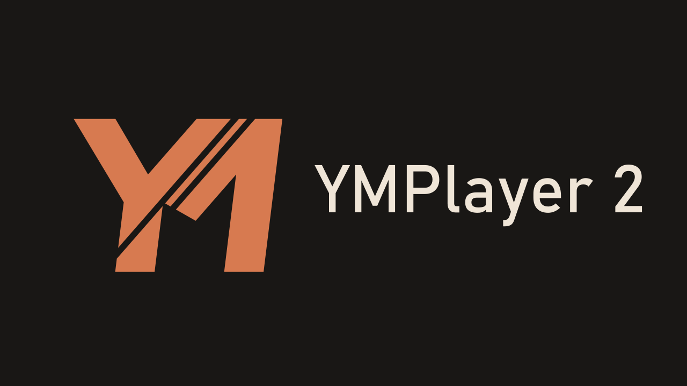

# YMPlayer 2

**Музыка на вашем экране — дома, на телевизоре и в дороге.**

Самостоятельный плеер для Android 10 и новее с адаптивным интерфейсом «Оксид»,
медиатекой и отдельными профилями. 2.x — новая независимая ветка приложения,
а не обновление [YMPlayer 1.x](https://github.com/reziarlleh/YMPlayer).
Для работы 1.x не требуется. У ветки 2.x свои данные и канал обновлений;
при одновременной установке версии не конфликтуют.

**Стабильный выпуск — [2.3.1-build76](https://github.com/reziarlleh/YMPlayer2/releases/tag/v2.3.1-build76).**
Локальная/USB и Яндекс-музыка, профили, «Моя волна», плейлисты, офлайн
«Мне нравится», клипы, системные медиакоманды и обновлятор с резервной загрузкой.
Проверены Android 15/TV 29, крупный шрифт, подписанное аудио и переход beta→stable
с сохранением данных. Аппаратная приёмка K4811/CWG и личные серверные сценарии
учитываются отдельно. В 2.1.0 доступны пользовательские скины;
[проверки M13](docs/M13_VERIFICATION.md).
[Текущий статус](docs/PROJECT_STATUS.md) · [Порядок](docs/ROADMAP.md) ·
[Проверка выпуска](docs/RELEASE_2_3_1_VERIFICATION.md).

В 2.3.0 добавлена **история прослушивания**: последние 500 разных треков
каждого профиля, повторный запуск, недоступные источники и очистка с подтверждением.
В 2.3.1 добавлен раздел **Недавно добавлено** для устройства/USB: дата первого
появления в медиатеке сохраняется при пересканировании. Дальше по [плану 2.3](docs/PLAN_2_3.md) — массовые действия. Разработка и исправления идут последовательно на main; предыдущие
выпуски 2.2 сохранены в истории.

В 2.2 доступны восемь языков: белорусский, английский, французский, немецкий,
казахский, русский, испанский и украинский. **Настройки → Язык приложения**:
Auto первым и по умолчанию, далее языки по английскому алфавиту. Выбор сохраняется;
язык меняется без остановки музыки. Названия музыки, плейлистов и скинов остаются
исходными. [Результаты Android/TV](docs/M14_ALL_LANGUAGES_VERIFICATION.md) ·
[Добавление переводов](docs/LANGUAGE_TRANSLATIONS.md).

[Тема на 4PDA — описание, APK и обсуждение](https://4pda.to/forum/index.php?showtopic=1127108).

**[Руководство пользователя — со скриншотами и значками кнопок](docs/USER_GUIDE.md).**
[English user guide](docs/USER_GUIDE_EN.md).
Установка, вход по коду, профили, плеер, поиск, лайки, плейлисты, офлайн,
качество звука, клипы, настройки и смена скинов.
Для создания своего оформления — [руководство автора скинов](docs/SKIN_AUTHOR_GUIDE.md).

  

## Что уже есть

- Адаптивные плеер и мини-плеер, светлая и тёмная темы.
- «Назад» поднимает на уровень выше; на главном плеере двойное нажатие закрывает интерфейс.
- Медиатека с разделами, деталями, поиском, фильтрами источника/доступности и выдачей каталога порциями по 80. Локальные и USB-метаданные хранятся в дисковом индексе; последовательное локальное воспроизведение загружает в Media3 ближайшие треки. Экран каталога читает порции из SQLite; ручные списки сохраняют ссылки и передают в Media3 максимум три трека.
- Выбор папок устройства/USB, чтение тегов, поиск и обновление каталога.
- Встроенные обложки локальных файлов с ограниченным кэшем изображений.
- Настоящее фоновое воспроизведение через Media3 и системные медиакоманды.
- MediaBrowser для внешних пультов: «Моя волна» и скачанные «Мне нравится» через Media3 и системный Android API.
- Повтор трека/очереди, перемешивание, добавление и редактирование очереди.
- Локальные плейлисты: создание, переименование, порядок треков и запуск выбранного списка.
- Избранное и плейлисты отдельно для каждого профиля; исходные файлы музыки не меняются.
- Локальные профили с отдельными очередями, позициями и режимами; восстановление на паузе.
- Вход Яндекса по коду отдельно для каждого профиля, шифрованное хранение и локальный выход.
- Поиск Яндекса: треки, альбомы, исполнители и плейлисты, детали и следующие страницы.
- «Мне нравится» и плейлисты аккаунта; запуск показанных треков и добавление в очередь.
- Облачные плейлисты: приватное создание, переименование, добавление/удаление треков, изменение порядка и удаление своего списка с подтверждением.
- Компактные карточки плейлистов: все действия трека внутри карточки; в редакторе порядок меняется перетаскиванием на сенсорном экране или точной позицией с пульта.
- «Моя волна» с продолжением, получением следующей рекомендации и радио-feedback.
- Рекомендованные плейлисты, любимые исполнители и любимые альбомы.
- Лайк и «никогда не предлагать» отдельно для трека и исполнителя; любимые альбомы отдельно.
- Значки с текущим состоянием у трека; действия исполнителей и альбома — в «…», обновление после возврата из фона.
- Кликабельные имена исполнителей: карточки с популярными треками и альбомами.
- Главный плеер без прокрутки, крупные кнопки, повтор/перемешивание обычных списков и запуск внешнего EQ/DSP.
- Потоковое аудио без скачивания всей коллекции; повтор после ошибки и отдельные очереди профилей.
- «Мне нравится» офлайн: аудио и настоящие обложки, фоновая ручная синхронизация,
  Wi-Fi по умолчанию, отмена/повтор и независимый ремонт файлов; кэш отдельно для профиля/аккаунта. Его можно полностью выключить для устройства, сохранив онлайн-воспроизведение.
- Отдельные настройки качества онлайн-аудио и офлайн-кэша; текущий трек и готовые файлы сохраняют своё качество.
- Сохранение ручной очереди при недоступном носителе; возвращённый текущий трек остаётся на паузе.
- Управление касанием и пультом Android TV, поддержка крупного шрифта.
- Диагностика в настройках: ограниченный журнал событий без секретов, очистка и экспорт в Downloads.
- Отдельный полноэкранный плеер волны клипов: управление, диагональная панель текущего и следующего клипа, сохранение сессии при повороте, предзагрузка начала следующего видео, продолжение после пустого ответа очереди и пауза аудио при входе.
- Встроенный SideBar для K4811 поверх приложений после пользовательского разрешения: короткий свайп от невидимых узких зон трёх краёв; белый контур со скосами 45°, круглые кнопки на затемнённом полупрозрачном фоне. Настраиваются громкость +/−, mute, Play/Pause, Home, меню, Back, сон и подтверждаемая перезагрузка. Сон и перезагрузка идут последними перед обязательной кнопкой «Спрятать сайдбар». Без остальных кнопок SideBar отключается. Слой находится ниже клавиатуры.
- Обновление сохраняет проверку и загрузку при повороте экрана; уже установленные APK удаляются, ожидающее обновление сохраняется.
- Проверка обновлений при запуске (не чаще раза в сутки) и вручную в настройках: сравнение валидных манифестов GitHub, jsDelivr и Gcore, проверка размера/SHA-256/пакета/подписи APK, затем системное подтверждение установки Android. Автопроверку можно выключить.
- Самостоятельный APK с собственной подписью и сквозной нумерацией Build.

Оформление «Оксид» выделено в отдельные редактируемые палитры и векторы;
экраны используют единый контракт. В 2.1.0 добавлены импорт .ymskin, preview,
сохранение и безопасный возврат к базовому скину. «Гавань», «Олива» и «Серебро»
встроены и имеют редактируемые исходники. [Руководство автора](docs/SKIN_AUTHOR_GUIDE.md),
[пакеты и шаблон](skins/README.md), [об оформлении](docs/SKINS.md).

Утверждены монограмма №4 / r5 и палитра №1 «Оксид»:
медный акцент, тёплый графит и светлая слоновая кость. Новая айдентика,
adaptive launcher и плитка Android TV входят в финальный 2.0.1.
[Исходники оформления](docs/design/brand/README.md).
M13 реализован и проверен: пользовательские скины, готовые темы и руководство
выпущены в 2.1.0-build64. Системные брендовые ресурсы остаются официальными.

[Build55](docs/M11_12_VERIFICATION.md) объединяет локальные/USB и Яндекс-результаты в одном каталоге и поиске. Страницы относятся только к просмотру; плеер использует ссылки и курсор, волна заранее готовит следующий трек.
Физические проверки SideBar/K4811, CWG, кнопок и boot остаются открытыми, но не
останавливают независимую разработку. [Текущая контрольная сверка](docs/AUDIT_2026-10-02.md).
Офлайн-кэш синхронизирует только понравившиеся треки. Любимые
исполнители и альбомы не загружаются целиком автоматически.
Подробные критерии и границы — в [дорожной карте](docs/ROADMAP.md).

## Сборки и проверка

2.2.2-build74: исправлены пять проблем, найденных аудитом: неподдерживаемый
AIFF в каталоге, накопление установочных APK, потеря состояния обновления при
повороте, вложенные переводы ошибок и чтение подписи APK на Android10.
89 JVM-тестов и 44 разных сценария на каждом проектном Android/TV прошли;
повторы старых тестов и границы проверки описаны в
[отчёте patch](docs/PATCH_2_2_2_VERIFICATION.md).
На Android10 старый обновлятор может отклонить первую исправленную версию:
в этом случае скачайте APK со страницы выпуска и установите поверх текущего,
сохранив данные.

Предыдущий 2.2.1-build72: восемь языков и сохраняемый выбор Auto в отдельном модуле.
Выпуск без beta доступен обычным обновлением; package и подпись прежние.
Проверены 24 разных сценария на каждом Android/TV, включая шрифт 200%,
release/R8/lint, подпись, установка поверх71 и загрузка GitHub/jsDelivr/Gcore.
[Проверки и публикация всех языков](docs/M14_ALL_LANGUAGES_VERIFICATION.md).

Контрольная сверка 2026-10-02: сборка, 89 JVM-тестов, каталог переводов,
локальные ссылки и опубликованные APK/манифесты проверены.
Найденные дефекты, исправления и оставшиеся внешние ограничения — в
[багрепорте](docs/BUG_REPORT.md); он отделён от результатов испытаний.
Google Play отложен до решения владельца и возможности оплатить публикацию донатами.

Предыдущий stable build69: настройки офлайн-кэша отделены от списка в медиатеке.
Параметры, синхронизация и очистка находятся в настройках; треки — в «Медиатека → Офлайн».
Папки с музыкой доступны из общего каталога, без лишней ссылки в настройках.
Проверены Android 15/TV29, возврат в родительский раздел, пульт и использование кэша.
[Проверка patch](docs/PATCH_2_1_5_VERIFICATION.md).

Build68: единая верхняя строка на всю ширину экрана;
левое меню начинается под ней, сокращённый логотип из меню убран.
Проверены Android/TV и короткий альбомный экран. [Проверка patch](docs/PATCH_2_1_4_VERIFICATION.md).

Build67: окно **О приложении** с версией, GitHub, ссылкой
на донат и QR. Открывается из настроек и по нажатию на широкий логотип
в заголовке; поддерживает пульт TV. [Проверка patch](docs/PATCH_2_1_3_VERIFICATION.md).

Build66: исправлен выход ↑/↓ из прогрессбара и пропуск выбранных
пунктов в строках медиатеки/поиска при управлении пультом. Проверены Android 15/TV29,
подписанная установка поверх65 и сохранение выключенного кэша.
[Проверка patch](docs/PATCH_2_1_2_VERIFICATION.md). Владелец подтвердил исправления пульта.

Build65 добавил выключатель офлайн-кэша, управление клипами с пульта
и прогресс в фоне текущего видео. [Проверка](docs/PATCH_2_1_1_VERIFICATION.md).

Build64 добавил пользовательские скины, preview, сохранение и откат.
Проверены реальные пакеты, touch/D-pad, 200% текст и смена оформления при
WAV/HLS/DASH. [Результаты M13](docs/M13_VERIFICATION.md).

Предыдущий patch build62: «Офлайн» в поиске фильтрует кэш текущего профиля
без перехода в медиатеку; текст запроса сохраняется между источниками. Семь
сценариев каталога/поиска прошли на Android 15 и TV 29. Айдентика/TV-плитка
build60/61 и функциональные результаты M12.7/M12.8 сохранены в своих отчётах.
[Контроль документации и GitHub](docs/DOCUMENTATION_AUDIT_2026-10-01.md).

### История этапов и проверок

Репозиторий публичный. Выпущенные APK и сведения об их проверке
привязаны к номеру Build. [Диагностика M8.3](docs/M8_3_VERIFICATION.md),
[медиакнопки и аудиофокус M8.2](docs/M8_2_VERIFICATION.md),
[системный MediaBrowser M8.1](docs/M8_1_VERIFICATION.md),
[уплотнение карточек M7.6](docs/M7_6_VERIFICATION.md),
[компактные карточки и перетаскивание M7.5](docs/M7_5_VERIFICATION.md),
[редактор плейлистов M7.4](docs/M7_4_VERIFICATION.md),
[облачные плейлисты M7.3](docs/M7_3_VERIFICATION.md),
[качество потока/кэша M7.2](docs/M7_2_VERIFICATION.md),
[«Мне нравится» офлайн M7.1](docs/M7_1_VERIFICATION.md),
[режимы очереди и Stop волны M6.4](docs/M6_4_VERIFICATION.md),
[главный экран и карточки M6.3](docs/M6_3_VERIFICATION.md),
[продолжение волны M6.2](docs/M6_2_VERIFICATION.md),
[видимые отметки M6.1](docs/M6_1_VERIFICATION.md),
[волна и отметки M6](docs/M6_VERIFICATION.md),
[каталог и аудио M5](docs/M5_VERIFICATION.md),
[исправление входа M4.1](docs/M4_1_VERIFICATION.md),
[отчёт M4](docs/M4_VERIFICATION.md), [отчёт M3.3](docs/M3_3_VERIFICATION.md),
[отчёт M3.2](docs/M3_2_VERIFICATION.md),
[отчёт M3.1](docs/M3_VERIFICATION.md), [отчёт M2](docs/M2_VERIFICATION.md),
[история UI-прототипа M1](docs/M1_VERIFICATION.md).

Последний stable: [2.0.1-build61](https://github.com/reziarlleh/YMPlayer2/releases/tag/v2.0.1-build61).
[Финальная айдентика и проверки](docs/BRAND_2_0_1_VERIFICATION.md). Первый stable 2.0.0 — build57.
[M12.8](docs/M12_8_VERIFICATION.md): настоящая установка из beta56 через резервный источник, сохранение каталога/позиции, stable-канал и signed WAV/фон/системные кнопки/холодный запуск.
Предыдущая beta — build56.
[M12.7](docs/M12_7_VERIFICATION.md) исправляет сохранение профиля при медленном чтении и немедленное сохранение repeat/shuffle. Проверены 190 native-сценариев, 86 JVM, пять updater-проверок; reboot телефона/TV и подписанное аудио прошли. [M9.6](docs/M9_6_VERIFICATION.md) добавляет доказательства HLS/DASH и 60 естественных окончаний клипа.
Аудит и переход beta→stable завершены; независимая приёмка K4811/HyperOS перечислена в текущем статусе.
Ранее build55:
Общий каталог, поиск и фильтры локальных/USB и Яндекс-результатов: [M11.12](docs/M11_12_VERIFICATION.md). Проверены 17 сценариев Android 15, 16 при 200% и шесть Android TV; обновление подписанного APK 54→55, фоновое WAV-аудио, системные кнопки и восстановление позиции на паузе.
Ранее:
[M11.11/build54](docs/M11_11_VERIFICATION.md) хранит ручной порядок ссылками и передаёт в Media3 максимум три соседних трека. Проверены списки из 5 002 ссылок, редактирование, shuffle/repeat, миграция сохранённого порядка и восстановление после полной перезагрузки. На Android 15 прошли 85 сценариев без ошибок; подписанный APK отдельно проверен с настоящим фоновым WAV-аудио, системными кнопками и восстановлением позиции на паузе. «Моя волна» сохраняет отдельную сессию с подготовленным следующим треком. Объединение источников реализовано в build55.
Ранее [build53](docs/M11_10_VERIFICATION.md) убрал постоянный полный снимок локальной библиотеки, а [build52](docs/M11_9_VERIFICATION.md) перенёс автоматические shuffle/repeat ALL на ID и адресное чтение метаданных.
Ранее build39 начал [M11: выдачу медиатеки порциями и фильтр доступности](docs/M11_1_VERIFICATION.md).
Ранее build38 добавил [«Сон» и подтверждаемую «Перезагрузку»](docs/M10_4_VERIFICATION.md) по рабочей логике 1.x.
Ранее build37 добавил [невидимые зоны жеста, белые круглые кнопки и команды K4811](docs/M10_3_VERIFICATION.md).
Ранее build36 обновил [форму боковой панели и зоны касания](docs/M10_2_VERIFICATION.md),
а build34 добавил [саму панель и настройку кнопок](docs/M10_1_VERIFICATION.md).
Ранее появились [предзагрузка и продолжение волны build33](docs/M9_5_VERIFICATION.md),
[диагональная панель build32](docs/M9_4_VERIFICATION.md) и исправления
[поворота, очереди и левого меню build31](docs/M9_3_VERIFICATION.md).
Владелец подтвердил базовое воспроизведение видео на HyperOS, затем нормальную
работу меню и видеоплеера после build31 и одобрил диагональную панель build32.
Позднее M9.6 проверил сегменты и 60 окончаний, M11 завершил общий каталог.
Живая сеть HyperOS и физический SideBar K4811 остаются независимой приёмкой.

Build21 уплотняет строки трека и исполнителя, а источник с длительностью
переносит в центр ряда действий. Проверены 83 JVM-теста, по 8 сценариев
плейлистов на Android/TV, обычный и 200% шрифт, обновление с build20.
[Отчёт M7.6](docs/M7_6_VERIFICATION.md).

Build20 объединяет сведения и действия одного трека внутри компактной карточки
плейлиста. Редактор оформлен так же; на сенсорном экране треки можно
перетаскивать за рукоятку, а с пульта менять точную позицию. Проверены 83 JVM,
132 TV native-теста, 131 из 132 в первом полном прогоне телефона и успешный
повтор одного теста после сбоя System UI эмулятора. Подписанный APK установлен
поверх build19 на обоих эмуляторах. Личная серверная запись и HyperOS остаются
за приёмкой владельца. [Отчёт M7.5](docs/M7_5_VERIFICATION.md).

Build19 завершает редактор своих плейлистов Яндекса: переименование, удаление
конкретного вхождения трека и перемещение на выбранную позицию. Добавление через
«…» сохраняется. Проверены 83 JVM-теста, по 127 native-тестов Android/TV,
шрифт 200%, пульт, обновление с build18 и фоновое аудио подписанного APK.
Запись в личный аккаунт проходит приёмку владельцем. [Отчёт M7.4](docs/M7_4_VERIFICATION.md).

Build18 добавляет создание приватных плейлистов Яндекса, добавление трека через
«…» и удаление своего списка с подтверждением. Перенесены рабочие алгоритмы 1.x;
текущая очередь, лайки и офлайн-кэш сохраняются. Пройдены 78 JVM-тестов,
по 115 native-тестов Android/TV и финальные проверки диалогов, шрифта 200% и пульта.
Личная серверная приёмка остаётся отдельной. [Отчёт M7.3](docs/M7_3_VERIFICATION.md).

Build17 добавляет **Настройки → Качество звука**: независимые предпочтения потока
и постоянного кэша по рабочему алгоритму 1.x. Выбор применяется к новым запросам,
включая предзагрузку волны; исправные сохранённые файлы повторно не скачиваются.
Проверены 70 JVM-тестов, по 106 native-тестов Android/TV и шрифт 200%.
[Результаты и границы проверки M7.2](docs/M7_2_VERIFICATION.md).

Build16 добавляет **Медиатека → Офлайн**: сохранение только «Мне нравится»,
проверку аудио/обложек, отмену и повтор синхронизации, удаление после снятия лайка
и воспроизведение без сети. Проверены 68 JVM-тестов, по 99 native-тестов Android/TV
и настоящий публичный MP3-превью с обложкой. Личная полная коллекция и HyperOS
проверяются отдельно. [Перенос из 1.x и результаты M7.1](docs/M7_1_VERIFICATION.md).

Build15 сохраняет режим «Моей волны» после Stop и восстановления. Повтор и
перемешивание доступны только для обычных списков; системный контроллер тоже
не может включить их для волны. Компоновка build14 сохранена.
[Исправление и проверки M6.4](docs/M6_4_VERIFICATION.md).

Build14 меняет главный плеер: все элементы помещаются без прокрутки, основные
кнопки увеличены, действия исполнителей перенесены в «…». Имена открывают карточки
с популярными треками и альбомами. Добавлена кнопка внешнего EQ/DSP.
[Проверки экранов, API и APK](docs/M6_3_VERIFICATION.md).

Build13 исправляет продолжение волны по правилам 1.x: полный следующий файл
готовится в фоне, повторы ответа не скрывают новые треки, временные ошибки
получают ограниченные повторы, повреждённое аудио пропускается. Pause/Stop
сохраняют приоритет. [Перенос и проверка M6.2](docs/M6_2_VERIFICATION.md).

В build12 значки лайка/дизлайка находятся рядом с треком и каждым исполнителем.
Заливка показывает текущую отметку из Яндекса; загрузка и неизвестное состояние
отображаются отдельно. Проверены 54 JVM-теста, по 72 Android/TV-теста,
шрифт 200% и обновление с build11. [Отчёт M6.1](docs/M6_1_VERIFICATION.md).

Build11 переносит сессию «Моей волны» из 1.x, добавляет рекомендованные плейлисты
и раздельные отметки трека/исполнителя/альбома. Проверены 54 JVM-теста,
по 69 Android/TV-тестов, крупный шрифт и обновление с build10.
Владелец подтвердил запуск рекомендаций и волны, затем сообщил об остановке
после второго трека; исправление описано в M6.2. Персональные отметки ещё проверяются.
[Отчёт и сценарии проверки](docs/M6_VERIFICATION.md).

Build10 исправляет перенос аудио из 1.x: значение `ts` в ответе Яндекса сохраняется
строкой, включая буквы, восстановлен выбор аудиоварианта AUTO. До исправления
build9 отклонял настоящий ответ. Проверены по 17 сценариев Android/TV, включая
воспроизведение публичного аудиопревью по сети через Media3. [Отчёт M5.1](docs/M5_1_VERIFICATION.md).

В build9 добавлены онлайн-поиск четырёх типов, коллекция Яндекса и потоковое аудио.
Проверены 43 JVM-теста, по 50 native-тестов Android/TV, крупный шрифт и обновление
с build8. Владелец подтвердил поиск и избранное; сбой воспроизведения исправлен
в build10. 2026-09-12 владелец подтвердил работающее воспроизведение.

В build8 исправлен порядок сохранения OAuth по рабочему 1.x и повтор ожидания
после сетевого сбоя. 2026-09-11 владелец подтвердил успешный вход на своём
Android 15 / HyperOS после исправления.

Проверки включают Android 35 и Android TV 29, реальный аудиодвижок, фон,
восстановление состояния, ошибки файлов и регрессии интерфейса. Физические
K4811/USB проверяются отдельно. Для выбора папок нужен системный DocumentsUI
или файловый менеджер с поддержкой SAF; в некоторых TV-прошивках его нет.

## Разработка

Kotlin · Jetpack Compose · Android 10+ · JDK 17 · Gradle wrapper.

- [Собрать проект](docs/BUILDING.md) · [Участвовать](CONTRIBUTING.md).
- [Дорожная карта](docs/ROADMAP.md) · [Текущий статус](docs/PROJECT_STATUS.md) · [Функции](docs/FEATURE_INVENTORY.md).
- [Архитектура](docs/ARCHITECTURE.md) · [Модули](docs/MODULES.md) · [Карта миграции](docs/MIGRATION_MAP.md).
- [UI/UX](docs/UI_UX_CONCEPT.md) · [Дизайн-система](docs/DESIGN_SYSTEM.md) · [Адаптивность](docs/RESPONSIVE_RULES.md).
- [Версии и Build](docs/VERSIONING.md) · [Исходные требования](YMPlayer_2x_Codex_Startup_Prompt.md).

## Поддержать автора

Если вам нравится направление проекта, можно поддержать его разработку.
Донат добровольный и не влияет на доступ к функциям приложения.

   
  <a href="https://donate.stream/donate_6a60559cd9e35"><strong>Поддержать разработку YMPlayer</strong></a>

