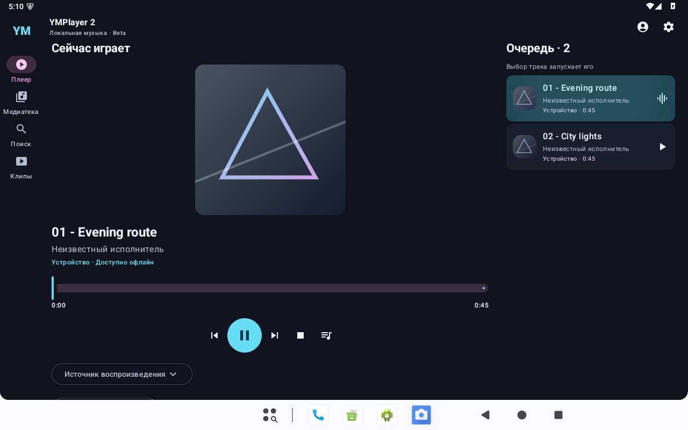

# YMPlayer 2

**Музыка на вашем экране — дома, на телевизоре и в дороге.**

Самостоятельный плеер для Android 10 и новее с адаптивным интерфейсом PRISM,
медиатекой и отдельными профилями. YMPlayer 2 устанавливается рядом с
[YMPlayer 1.x](https://github.com/reziarlleh/YMPlayer) и использует собственные данные.

> **Ранняя beta.** Подключены локальная медиатека и настоящий аудиоплеер.
> Добавлен вход в Яндекс по коду; онлайн-каталог и воспроизведение Яндекса,
> клипы, SideBar и импорт пользовательских скинов ещё разрабатываются.
> [Порядок этапов и переноса из 1.x](docs/ROADMAP.md).

  

## Что уже есть

- Адаптивные плеер и мини-плеер, светлая и тёмная темы.
- «Назад» поднимает на уровень выше; на главном плеере двойное нажатие закрывает интерфейс.
- Медиатека с разделами, деталями, поиском и фильтрами.
- Выбор папок устройства/USB, чтение тегов, поиск и обновление каталога.
- Встроенные обложки локальных файлов с ограниченным кэшем изображений.
- Настоящее фоновое воспроизведение через Media3 и системные медиакоманды.
- Повтор трека/очереди, перемешивание, добавление и редактирование очереди.
- Локальные плейлисты: создание, переименование, порядок треков и запуск выбранного списка.
- Избранное и плейлисты отдельно для каждого профиля; исходные файлы музыки не меняются.
- Локальные профили с отдельными очередями, позициями и режимами; восстановление на паузе.
- Вход Яндекса по коду отдельно для каждого профиля, шифрованное хранение и локальный выход.
- Сохранение ручной очереди при недоступном носителе; возвращённый текущий трек остаётся на паузе.
- Управление касанием и пультом Android TV, поддержка крупного шрифта.
- Самостоятельный APK с собственной подписью и сквозной нумерацией Build.

Оформление PRISM выделено в отдельные редактируемые палитры и векторы;
экраны используют единый контракт. Дополнительные скины, импорт и руководство для
авторов запланированы на один из последних этапов. [Об оформлении](docs/SKINS.md).

Следом: проверка живого входа Яндекса → каталог/поиск → волна →
избранное офлайн → CWG/диагностика → клипы → SideBar → скины → стабильный выпуск.
Подробные критерии и границы — в [дорожной карте](docs/ROADMAP.md).

## Сборки и проверка

Репозиторий пока приватный. Выдаваемые beta APK и сведения об их проверке
привязаны к номеру Build. [Отчёт M4](docs/M4_VERIFICATION.md), [отчёт M3.3](docs/M3_3_VERIFICATION.md),
[отчёт M3.2](docs/M3_2_VERIFICATION.md),
[отчёт M3.1](docs/M3_VERIFICATION.md), [отчёт M2](docs/M2_VERIFICATION.md),
[история UI-прототипа M1](docs/M1_VERIFICATION.md).

Последняя beta: [2.0.0beta-build7](https://github.com/reziarlleh/YMPlayer2/releases/tag/v2.0.0beta-build7).

Проверки включают Android 35 и Android TV 29, реальный аудиодвижок, фон,
восстановление состояния, ошибки файлов и регрессии интерфейса. Физические
K4811/USB проверяются отдельно. Для выбора папок нужен системный DocumentsUI
или файловый менеджер с поддержкой SAF; в некоторых TV-прошивках его нет.

## Разработка

Kotlin · Jetpack Compose · Android 10+ · JDK 17 · Gradle wrapper.

- [Собрать проект](docs/BUILDING.md) · [Участвовать](CONTRIBUTING.md).
- [Дорожная карта M1–M12](docs/ROADMAP.md) · [Текущий этап](docs/PROJECT_PLAN.md) · [Функции](docs/FEATURE_INVENTORY.md).
- [Архитектура](docs/ARCHITECTURE.md) · [Модули](docs/MODULES.md) · [Карта миграции](docs/MIGRATION_MAP.md).
- [UI/UX](docs/UI_UX_CONCEPT.md) · [Дизайн-система](docs/DESIGN_SYSTEM.md) · [Адаптивность](docs/RESPONSIVE_RULES.md).
- [Версии и Build](docs/VERSIONING.md) · [Исходные требования](YMPlayer_2x_Codex_Startup_Prompt.md).

## Поддержать автора

Если вам нравится направление проекта, можно поддержать его разработку.
Донат добровольный и не влияет на доступ к функциям приложения.

   
  <a href="https://donate.stream/donate_6a60559cd9e35"><strong>Поддержать разработку YMPlayer</strong></a>

