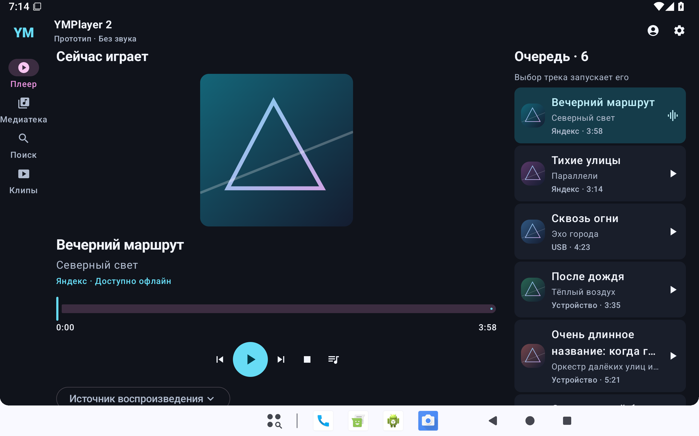

# YMPlayer 2

**Музыка на вашем экране — дома, на телевизоре и в дороге.**

Самостоятельный плеер для Android 10 и новее с адаптивным интерфейсом PRISM,
медиатекой и отдельными профилями. YMPlayer 2 устанавливается рядом с
[YMPlayer 1.x](https://github.com/reziarlleh/YMPlayer) и использует собственные данные.

> **Ранняя beta.** Первый этап `2.0.0beta-build1` — нативный UI-прототип на
> демонстрационных данных, пока без звука. Сейчас развивается локальный каталог
> и настоящее воспроизведение. Готовность интерфейса не означает готовность всех
> запланированных интеграций.

  

## Что уже есть

- Адаптивные плеер и мини-плеер, светлая и тёмная темы.
- Медиатека с разделами, деталями, поиском и фильтрами.
- Демонстрационные очередь и профили с независимым состоянием.
- Управление касанием и пультом Android TV, поддержка крупного шрифта.
- Самостоятельный APK с собственной подписью и сквозной нумерацией Build.

Следующие этапы: локальные файлы и USB, настоящий аудиоплеер и MediaSession,
авторизация и каталог Яндекса, офлайн-избранное, клипы и встроенный SideBar.
План не является списком уже работающих функций.

## Сборки и проверка

Репозиторий пока приватный. Выдаваемые beta APK и сведения об их проверке
привязаны к номеру Build. Первый артефакт описан в [отчёте M1](docs/M1_VERIFICATION.md).

Проверки M1 включают Android 35, Android TV 29, широкий и короткий экран,
крупный текст, навигацию и восстановление состояния. Физическая проверка K4811
и реальных аудиоинтеграций проводится отдельно.

## Разработка

Kotlin · Jetpack Compose · Android 10+ · JDK 17 · Gradle wrapper.

- [Собрать проект](docs/BUILDING.md) · [Участвовать](CONTRIBUTING.md).
- [План](docs/PROJECT_PLAN.md) · [Функции](docs/FEATURE_INVENTORY.md).
- [Архитектура](docs/ARCHITECTURE.md) · [Модули](docs/MODULES.md) · [Карта миграции](docs/MIGRATION_MAP.md).
- [UI/UX](docs/UI_UX_CONCEPT.md) · [Дизайн-система](docs/DESIGN_SYSTEM.md) · [Адаптивность](docs/RESPONSIVE_RULES.md).
- [Версии и Build](docs/VERSIONING.md) · [Исходные требования](YMPlayer_2x_Codex_Startup_Prompt.md).

## Поддержать автора

Если вам нравится направление проекта, можно поддержать его разработку.
Донат добровольный и не влияет на доступ к функциям приложения.

   
  <a href="https://donate.stream/donate_6a60559cd9e35"><strong>Поддержать разработку YMPlayer</strong></a>

