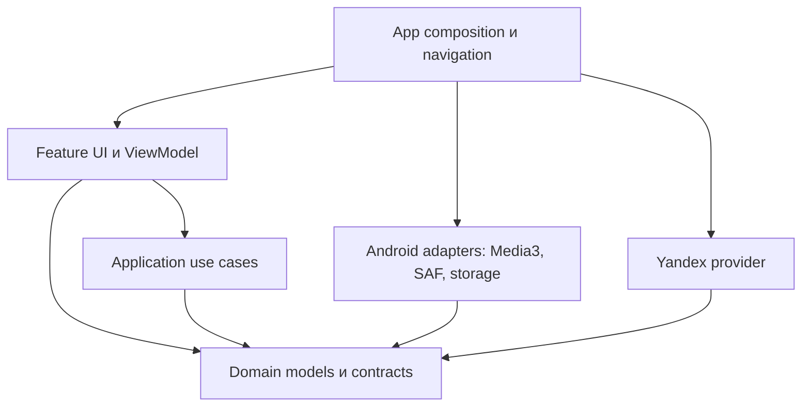

# Архитектурный эскиз

Исходный эскиз: 2026-09-09. Это описание первоначального направления;
формулировки «предлагается» ниже не являются текущим статусом этапов.
Фактический состав и проверки: [MODULES.md](MODULES.md),
[ROADMAP.md](ROADMAP.md), [PROJECT_PLAN.md](PROJECT_PLAN.md).
Минимальные границы реализованы в M1 ([ADR-002](DECISIONS/ADR-002-native-m1.md)).
Локальный каталог и Media3 подключены в M2
([ADR-003](DECISIONS/ADR-003-local-playback.md)); к M8.2 добавлены провайдер
Яндекса, офлайн-кэш, системный браузер и медиакнопки. Оформление развивается
как независимый слой со скинами:
[ADR-004](DECISIONS/ADR-004-skins.md), [SKINS.md](SKINS.md).
M13 добавляет данные пользовательских пакетов в этот слой:
[ADR-032](DECISIONS/ADR-032-skin-packages.md). Его локальное хранилище относится
только к оформлению и не заменяет функциональные хранилища.

К stable build72 фактически созданы 12 Gradle-модулей (см. MODULES).
LocalCatalogIndex использует SQLiteOpenHelper, а не предложенный ниже Room;
каталог читает страницы для UI, playback — курсор и три соседних трека.
Клипы, K4811 SideBar и независимый updater выделены отдельно. Цвета Compose
и native-панелей находятся в designsystem; внешний импорт скинов — M13.
M14 добавил отдельный localization-модуль: восемь языков, сохраняемый выбор
Auto и перевод app-owned статусов в UI. Музыкальные данные и протоколы не переводятся.

## Стек и границы

Предлагается Android/Kotlin, Jetpack Compose для нового UI, coroutines/Flow
для наблюдаемого состояния и отменяемой работы. Стартовый minSdk 29 сохраняет
известную базу устройств 1.x. Конкретные версии Gradle/AGP/Kotlin/Compose
зафиксировать совместимым набором при создании каркаса, не копировать по возрасту.

UI использует платформенные компоненты для тача и TV под общей дизайн-системой.
Для playback предлагается Media3 ExoPlayer и MediaLibraryService: каталог должен
быть доступен внешним media clients. Это новый адаптер; совместимость CWG,
локальных дескрипторов и поведение волны требуют отдельного сравнительного прогона.
До него замена MediaPlayer 1.x не считается доказанной.
Основание платформенного выбора:
[Media3 background playback](https://developer.android.com/media/media3/session/background-playback).

Для каталога предлагается Room с индексацией и страничными запросами; для
небольших настроек — DataStore. Реальные схемы хранения создаются при соответствующем
этапе. AppContainer с явными constructor dependencies достаточен на старте;
DI-framework не является предварительным требованием.

Стрелка означает зависимость исходного кода. Domain не импортирует Android,
Compose, Room или Yandex DTO. UI не создаёт backend/client и не обращается к
внутреннему хранилищу другого модуля. Подробности: [MODULES.md](MODULES.md).

## Владельцы состояния и контракты

| Область | Владелец | Публичная граница |
| --- | --- | --- |
| Активный профиль/аккаунт | ProfileManager | observeSession(), switchProfile(), signOut() |
| Очередь/позиция/режим/ошибка | PlaybackCoordinator в playback service | observePlayback(), dispatch(command) |
| Каталог и доступность | LibraryRepository | observe/query LibraryQuery, observeAvailability() |
| Источник потока | StreamResolver | resolve(MediaId, SessionContext) |
| Коллекция сервиса | MusicProvider capabilities | searchPage(), album(), playlist(), likes(), wave continuation |
| Синхронизация избранного | FavoritesSync | start/cancel/observe по AccountId |
| Временное состояние экрана | ViewModel | immutable UiState и UI actions |

Имена иллюстрируют границы, а не обещают конкретный API. Разделять capabilities:
поиск/каталог/плейлисты/волна/авторизация. Локальный источник не обязан имитировать
Yandex login или My Wave. Unsupported — явный результат, а не пустой успех.

MediaId включает sourceId и source-local key. Аккаунтные связи, коллекции и кэш
дополнительно адресуются AccountId/ProfileId. Не объединять две записи по одному
названию трека. Backend получает разрешённый ресурс с правилом освобождения;
публичный domain-контракт не переносит ParcelFileDescriptor наружу.

Команды: SelectSource (без Play), Play, Pause, Stop, Seek, Skip, ReplaceQueue,
Enqueue. Состояние содержит session generation, текущий MediaId, очередь,
позицию, режим, доступность и типизированную ошибку. StateFlow отдаёт актуальный
снимок новым подписчикам; события не заменяют состояние. Lyrics/история/будущие
интеграции наблюдают публичное состояние/события, а не private поля Player.

## Конкуренция и жизненный цикл

- Единственный сериализованный владелец обрабатывает playback-команды.
- Каждая асинхронная операция привязана к SessionContext(profile, account,
  generation). Callback проверяет актуальность; устаревший ресурс закрывается.
- Переключение профиля сохраняет checkpoint, останавливает старый playback,
  отменяет работы и меняет account scope. Старые результаты не меняют новый UI/кэш.
- UI scope принадлежит ViewModel; длительный playback — foreground service;
  индексирование/синхронизация — отдельный worker/coordinator с отменой и прогрессом.
- WorkManager рассмотреть для отложенной синхронизации; транспорт воспроизведения
  не запускать как фоновую задачу WorkManager.
- Вход, сеть, storage и playback имеют типизированные ошибки: expired login,
  unavailable media, no connection, permission revoked, malformed response.

## Медиатека, профили и кэш

Логические сущности: Profile, ProviderAccount, Track, Album, Artist, Genre,
StorageRoot, TrackAvailability, Playlist/PlaylistEntry, HistoryEntry,
PlaybackCheckpoint, SyncJob. Индекс метаданных отделён от аудиофайлов.

SAF-разрешение относится к установке приложения. Предложение: общий локальный
каталог и локальные плейлисты, независимые от Яндекса; история и checkpoint —
по профилю. Аккаунтные плейлисты/лайки/кэш изолированы по аккаунту. Изоляция
логических профилей не заменяет системную защиту разных Android-пользователей.

При отключении USB помечать доступность, не удалять каталог. Индексирование
сканирует только разрешённые корни и изменившиеся данные. Локальное удаление
плейлиста/индекса никогда не удаляет исходные файлы. Постоянный Яндекс-кэш —
только избранное; прочий кэш ограничен. Настоящее artwork хранится отдельно;
заглушка не записывается в медиа. Для позднего ответа после unlike проверять
актуальное состояние избранного перед фиксацией файла.

## Изоляция выпуска

ApplicationId/namespace M1: `dev.petrov.ymplayer2`, отличающийся от
проверенного `dev.petrov.yaplay`. APK подписан собственным ключом; данные и
AndroidX authorities/permission принадлежат своему пакету. Собственные actions,
аккаунтные ключи и update feed реализованы; stable72 опубликован в том же продукте.
Никакие endpoint 1.x или его APK автоматически не наследуются. Правила версий:
[VERSIONING.md](VERSIONING.md).
