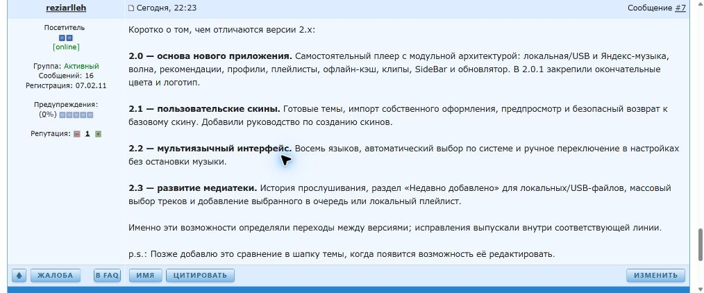

# Сравнение версий в теме 4PDA

2026-10-04 по прямому запросу владельца опубликовано одно новое сообщение
от аккаунта **reziarlleh**: [№7, post145366888](https://4pda.to/forum/index.php?showtopic=1127108&view=findpost&p=145366888).
Страница показывает дату 04.10.2026, 22:23 в часовом поясе форума.

В сообщении кратко изложены основные добавления 2.0, 2.1, 2.2 и 2.3;
добавлено примечание о будущем переносе сравнения в шапку.
[Точный опубликованный BBCode](FORUM_VERSIONS_4PDA.bbcode) сохранён отдельно
от исторических вариантов шапки.

Предпросмотр, DOM опубликованной страницы и снимок подтвердили автора,
номер сообщения, все четыре пункта и примечание. Прямая HTTP-авторизация
вернула403; публикация выполнена через обычный интерфейс браузера
с действующей сессией владельца. Пароль и cookies в документы/Git не записывались.

Шапка не изменена: у первого сообщения кнопка редактирования отсутствует.
Прямой запрос разрешает именно это отдельное сообщение; автоматических
дополнительных публикаций не планируется. APK и версия приложения не менялись.

## Следующая правка шапки после получения прав

- [ ] Добавить сравнение 2.0/2.1/2.2/2.3 из сообщения №7 в актуальную
  модераторскую структуру шапки, сохранив вложения и остальные требования
  [правил форума](FORUM_RULES_4PDA.md).
