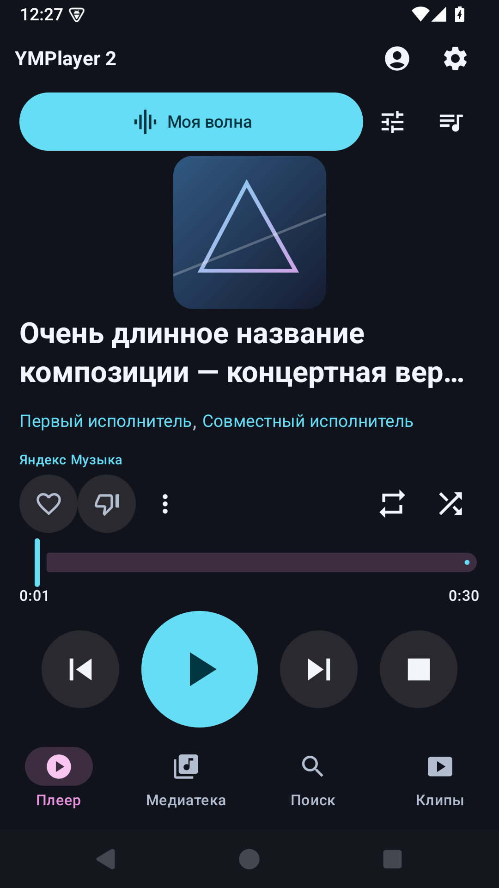
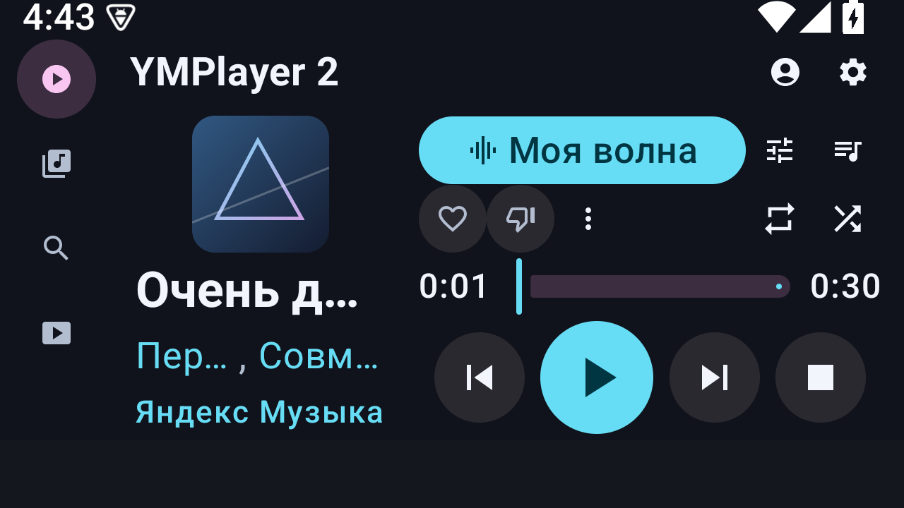

# M6.3 — компоновка плеера, карточки артистов и EQ/DSP

Реализация по прямому запросу владельца: главный экран без прокрутки,
крупное управление, действия артистов в «…», кликабельные имена и карточки
с популярными треками/альбомами. [Решение и reference](DECISIONS/ADR-013-fixed-player-and-artist-cards.md).

## Что изменено

- Исполнители у трека занимают одну строку. Каждое имя открывает свою карточку;
  нажатие не запускает музыку и не изменяет очередь. В списках действует та же схема.
- Сердце и «никогда не предлагать» на главном экране относятся только к треку.
  «…» сразу открывает отдельные действия исполнителей и любимого альбома;
  подтверждённые/неизвестные состояния Яндекса сохранены.
- Карточка: популярные треки в порядке сервера, альбомы с пагинацией, треки альбома.
  «Назад»: альбом → артист → исходный экран. Под карточкой сохраняется каталог.
- Плеер не содержит прокрутки. Play/Pause — 80–96 dp, Previous/Next/Stop — 64 dp.
  Обложка подстраивается под оставшееся место; короткое широкое окно использует
  время и полосу позиции в одной строке. Повтор/перемешивание скрыты для волны.
- Кнопка EQ/DSP открывает внешнее приложение или системную панель текущей сессии.
  Выбор приложения хранится в данных 2.x. Это перенос запуска EQ из 1.x,
  встроенная обработка звука здесь не добавлялась.

## Проверки

- **59 JVM-тестов**, без ошибок: вложенные карточки, возврат к каталогу и существующее ядро.
- **По 83 native-теста** на Android 15/API 35 и Android TV/API 29: навигация,
  каталог, аудио, волна, отметки, профили, хранилище и оформление.
- Финальная компоновка: **по 7 тестов** при шрифте 200% в окнах 360×640 dp,
  640×360 dp и TV 960×360 dp. Проверены отсутствие ScrollBy на главном экране,
  границы всех управляющих элементов, минимальные размеры кнопок, карточки и реакции.
- После полной регрессии изменено только размещение времени/Slider на коротком
  широком экране; эта ветка проверена финальной матрицей выше. Тесты каталога
  адаптированы к виртуализации строк при крупном шрифте. Один прогон TV ожидания
  fixture-поиска завершился таймаутом; повторный полный набор из 7 тестов прошёл.
- Реальный публичный Яндекс API, без OAuth и пользовательских данных: по одному
  native-прогону на Android/TV. Получены 10 популярных треков, 19 альбомов,
  открыты треки первого альбома. Это проверка протокола, не персонального аккаунта.
- Gradle debug/test APK и lint прошли: **0 ошибок, 20 предупреждений**.

Машинные результаты: [checks.json](qa/m6-3/checks.json), скриншоты: [qa/m6-3](qa/m6-3).
Полная регрессия: [Android](qa/m6-3/final-native-5580.txt), [TV](qa/m6-3/final-native-5582.txt).

## Сборка и приёмка

Подписан `2.0.0beta-build14`, versionCode 14, applicationId `dev.petrov.ymplayer2`.
APK без debug-флага; v2-подпись подтверждена, сертификат совпадает с build13.
[Метаданные](../releases/2.0.0beta-build14/build.json),
[подпись](../releases/2.0.0beta-build14/signature.txt),
[SHA-256](../releases/2.0.0beta-build14/SHA256.txt).

SHA-256 APK: `c4731dfc1912947076abea769174b05620bb22b40d10c0e04e746ecffc24037b`.

Обновление **build13 → build14** прошло на Android/TV с прежним firstInstallTime,
очередью и позицией, без автозапуска. Телефон: 3 трека, второй на 3 с;
TV: прежняя пустая очередь. Проверены входные экраны без аккаунта и сообщение
об отсутствии DocumentsUI на TV.

Подписанный телефонный APK прошёл [аудиопроверку](qa/m6-3/release-phone/playback/release-playback.json):
локальное воспроизведение, фон, системные Pause/Play/Next, foreground-сервис,
принудительное завершение процесса и восстановление на паузе.

EQ/DSP: на [телефоне](qa/m6-3/release-phone/equalizer.json) подтверждены запуск
системного action с положительным audioSessionId, package 2.x и CONTENT_TYPE_MUSIC,
продолжение аудио в панели, выбор внешнего DSP и повторный прямой запуск.
На [TV](qa/m6-3/release-tv/equalizer.json) проверены launcher и сохранённый выбор DSP.
Получатель — отдельный тестовый APK; для проверки extras штатный MusicFX эмулятора
временно отключался и затем был включён обратно. Эффекты к звуку тестовая панель не применяет.

Репозиторий 1.x не изменялся; прежние локальные файлы reference оставлены на месте.

Физический HyperOS/ГУ не устанавливался и не управлялся. Работа конкретного
стороннего DSP и изменение звука его эффектами требуют проверки на устройстве.
Длительная персональная «Моя волна» из M6.2 остаётся отдельной приёмкой.
Будущий офлайн-кэш синхронизирует только треки «Мне нравится».
