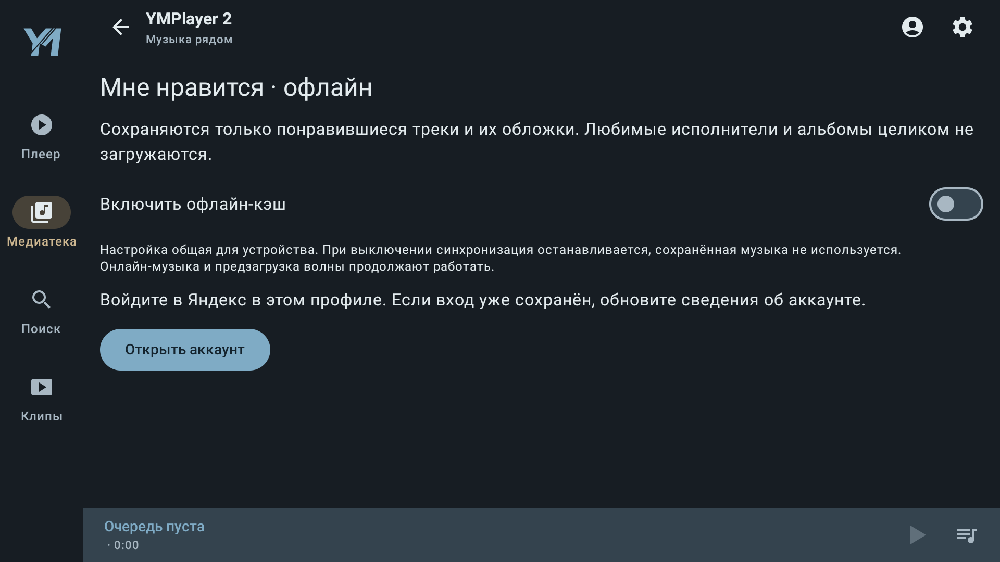

# 2.1.1 — кэш и управление клипами

Запрос владельца: явный выключатель постоянного офлайн-кэша, работа пульта
в клипах на TV, прогресс затемнением фона только текущего клипа. Дополнительно
уточнена самостоятельность 2.x в пользовательском описании.

## Реализация

- «Включить офлайн-кэш» — общая сохраняемая настройка устройства. Значение
  по умолчанию сохраняет прежнее поведение. Выключение отменяет синхронизацию,
  запрещает новые проходы, чтение аудио/каталога кэша и подстановку скачанных
  треков. Поколение операции и ревизия очистки исключают запоздалые записи.
  Существующие файлы сохраняются до явного удаления. Очистка доступна и при
  выключенном кэше. Онлайн-потоки и временная предзагрузка волны независимы.
- Корневой FrameLayout ClipActivity передаёт D-pad/Enter и медиаклавиши native-панели. Первый
  навигационный нажим возвращает скрытую панель и фокус, включая поглощение
  отпускания, чтобы не выполнить случайную команду. Следующие нажатия работают
  по фокусу. Play/Pause/Next/Previous имеют отдельные медиакоманды.
- Позиция и реальная длительность Media3 опрашиваются каждые 250 мс только
  при STARTED. Обновление не откладывает автоскрытие панели и не меняет фокус.
  Чёрный полупрозрачный слой рисуется до текста, клипуется диагональю текущего
  трека и не затрагивает следующий. Неизвестная длительность даёт нулевой
  прогресс; отрицательная/избыточная позиция ограничивается диапазоном.
- README и руководство прямо говорят: 2.x работает самостоятельно, 1.x не
  требуется; одновременная установка не создаёт конфликта.

## Проверка и выпуск

Дата: 2026-10-01. Выпуск **2.1.1-build65**, stable.

- `:core:test`: **89/89**, включая 12 OfflineMusicTest. Три новых сценария:
  отключение до запуска/повторное создание, поздняя загрузка, сохранение файлов
  и явная очистка при выключенном кэше.
- OfflinePlaybackTest: **11/11 на каждом** проектном эмуляторе Android 15/API35
  и Android TV/API29. Реальное аудио фикстуры скачано; выключение через UI
  скрывает файлы, запрещает запуск синхронизации/чтение, повторное включение
  возвращает сохранённые файлы. [Результаты](qa/patch-2-1-1/offline-results.json).
- ClipRemoteProgressTest, ClipControlsTest, ClipRotationTest,
  ClipTransportPlaybackTest: **7/7 на каждом** эмуляторе. Скрытие/возврат панели,
  D-pad-фокус, OK, Play/Pause, Next/Back, автоскрытие, поворот и реальные
  HLS/DASH-сегменты проверены. [TV](qa/patch-2-1-1/clips-tv.log) ·
  [Android 15](qa/patch-2-1-1/clips-phone.log).
- После усиления проверки реального position polling ClipRemoteProgressTest
  повторно прошли **2/2 на каждом** эмуляторе. При paused seek на 75% изменился
  фон текущей области; фон следующей остался прежним. В debug-тесте контроллер
  получает локальные метаданные волны и реальный MP4; живой аккаунт не нужен.
  [TV](qa/patch-2-1-1/progress-tv.log) · [Android 15](qa/patch-2-1-1/progress-phone.log).
- Debug/app androidTest и minified release собраны. Lint debug: **0 ошибок,
  31 предупреждение**; baseline/подавления не добавлялись.
  [Сводка](qa/patch-2-1-1/build-checks.json).
- Signed65 установлен поверх signed64 на обоих эмуляторах; выключатель доступен
  без входа в Яндекс и сохраняет opt-out после force-stop/нового запуска.
  [TV](qa/patch-2-1-1/release-ui-tv.json) · [Android 15](qa/patch-2-1-1/release-ui-phone.json).
- package `dev.petrov.ymplayer2`, versionCode65, versionName2.1.1-build65,
  подпись APK v2 подтверждены. Сертификат прежний:
  `fbc7f884d76568e5b5f7be16e83b4a39f1fedad334ebd0be7fba7aa0bea406ec`.
  APK 4 870 009 байт, SHA-256
  `d42fd4d4a77a8f8ba4c9f137a738a4d0d69e2751548524067e6fc8a4b92fbc33`.
  [Метаданные](../releases/2.1.1-build65/build.json) ·
  [Подпись](../releases/2.1.1-build65/signature.txt).

### Исправленные ошибки при проверке

Первоначальное переопределение Activity.dispatchKeyEvent нарушало ограничение
AndroidX, что обнаружил lint. Обработка перенесена в корневой native FrameLayout,
без подавления проверки. Native-прогон выявил потерю фокуса после touch mode;
кнопки теперь допускают фокус в этом режиме. Тест закрытия Activity ожидал
асинхронный DESTROYED слишком рано — добавлено ожидание реального завершения.
В исходном объединённом прогоне 18 тестов был один clip-сбой на каждом эмуляторе;
11 offline-тестов были успешны. Повторная clip-регрессия выше полностью прошла.

### Снимки

Снимки необработанные. Новый кадр клипов добавлен в руководство с обозначением
происхождения; прочие пользовательские снимки остаются build64.

### Границы

Проверены проектные эмуляторы, локальное аудио/MP4/HLS/DASH и подписанная установка.
Физический пульт телевизора владельца и живая сеть/волна Яндекса этим прогоном
не проверялись. Алгоритмы получения рекомендаций и предзагрузки не менялись.
Полная регрессия M12.7 не повторялась; выбранные проверки соответствуют изменениям.

### Публикация

[GitHub Release](https://github.com/reziarlleh/YMPlayer2/releases/tag/v2.1.1-build65).
Выпуск опубликован как latest stable (без draft/prerelease); текст заметок
совпадает с подготовленным. GitHub, pinned jsDelivr и pinned Gcore отдали APK65
с одинаковыми размером/SHA-256. Первое чтение Gcore истекло по таймауту; повторное
чтение успешно. Raw stable/общий манифесты — 65. Динамические CDN @main ещё
возвращают stable64/62; клиент выбирает максимальный Build среди доступных
источников. При недоступности GitHub обнаружение через CDN может запоздать,
при этом прямой резервный APK65 доступен. [HTTP-доказательства](qa/patch-2-1-1/publication.json).

## 4PDA

По решению владельца ожидаем переноса темы и прав редактирования. Шапка
актуализируется после этого; модератору и в тему сообщения не отправляются.
Подготовленный BBCode сохраняется отдельно от последней опубликованной копии.
