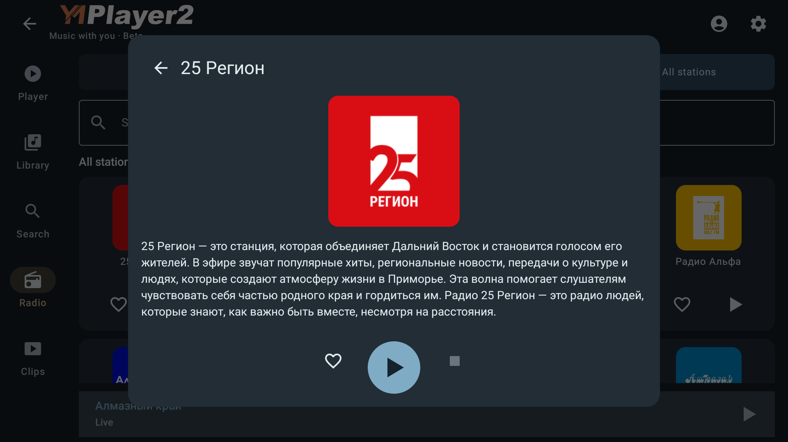

# Каталоги Радио и карточки станций — beta2.5

Задача владельца7 октября2026 после beta92: жанры не работают, города остаются
в загрузке, маленький каталог; Коллекция должна сохранить две карусели, остальные
вкладки показывать вертикальную сетку. На станции отдельные Like/Play; изображение
открывает большую карточку с описанием, Back возвращает место и фокус списка.

## Причина и исправление

`loadOptions` сохранял `state.value.copy(cities = api.cities())` / genres.
Receiver copy вычислялся до приостановки API, поэтому второй ответ возвращал
старые поля и затирал первый результат, включая citiesBusy. Теперь сначала
ожидается ответ, потом изменяется текущее состояние. Справочники кешируются;
ошибки городов/жанров разделены и доступны для явного повтора.

Сам API подтверждён текущими публичными запросами. Genres содержит rock,
regions — moscow. Первый каталог50; последовательная загрузка до конца дала
273 уникальные станции за6 страниц (50×5 +23), hasNext=false в конце.
Это датированный срез, а не обещание постоянного количества. Genre rock36,
Москва31 поток: оба ответа корректно разбираются. Кнопка прежней карусели
была ручной и находилась в конце горизонтального списка: новый UI догружает
у конца viewport автоматически; после ошибки сохраняет строки/cursor и ждёт
явного повтора, не образуя цикла запросов. Пагинация также передаётся фильтрам.

Native-тест выявил вторую причину короткого списка: `loadList` сравнивал первый
cursor новой вкладки с cursor прежней вкладки. При Collection→All первые50
имеют тот же cursor, поэтому hasNext становился false. Защита от повторного
cursor теперь применяется только к append; аналогично исправлен refresh
коллекции. Новый JVM-тест покрывает оба свежих списка и повторный append cursor.

## Реализация / границы

- Коллекция: избранные и общий каталог двумя горизонтальными каруселями.
- Города/Жанры/Все станции и глобальный поиск: LazyVerticalGrid с догрузкой.
- У каждой станции отдельные Like/Play; изображение открывает карточку, не играет.
- Большая карточка получает description из реального API; HTML преобразуется
  в простой текст, без выполнения содержимого. Вход/сердце относятся к станции.
- Каталог остаётся составленным за модальной карточкой: grid/list state не
  пересоздаётся; после закрытия FocusRequester возвращает исходную кнопку.
- Details имеют отдельный запрос/поколение: поздний результат после закрытия
  или смены профиля не открывает чужую карточку. Данные источника/сеанса beta92
  и общая аудиосессия сохраняются; новые Gradle-модули не создаются.

## Проверки

Первичная сборка UI прошла. Добавлены адресные JVM-проверки конкурентных
справочников, независимой ошибки, cache/retry, append failure и details lifecycle;
UI-проверки полной пагинации, раздельных действий и возврата фокуса/координат.
Native-проверка настоящего API выполняет Genres/Cities/All через рабочий экран.
Контроль с временным возвратом захвата state до await воспроизвёл падение
`parallelCityAndGenreResponsesPreserveBothResultsAndFlags`; после восстановления
исправленного source полный JVM-прогон прошёл. Первый native-прогон сохранил
настоящую ошибку cursor (20 вместо64). Исправлено в продукте; тест ждёт именно
первую страницу fixture, исключая попадание на старые строки при смене вкладки.
На телефоне Play первой карусели находился вне видимой части verticalScroll:
первоначальная автоматизация нажимала координату без прокрутки и получала
requests=0. Тест теперь сначала прокручивает к кнопке. Для проверки возвращённого
keyboard/remote фокуса используется реальный DPAD, выводящий Android из touch mode;
ожидание закрытия Dialog учитывает асинхронное восстановление фокуса.

- 115 JVM (111 core +4 app), failures/errors0; release lint0 errors,64 warnings.
  Проверка666 сообщений/8 пакетов переводов прошла; новых текстов в UI нет.
- TV10/API29:26 сценариев пройдены,2 специальных пропуска (отдельные seed/verify
  и cleanup). Android9/API28:25 пройдены после корректировки прокрутки теста,
  те же2 пропуска и TV-only. Итого51 разных сценариев/устройств,5 ожидаемых пропусков.
  [Логи и сводка](qa/radio-catalog-2026-10-07/checks.json) сохраняют исходные failures
  и отдельный успешный повтор исправленной автоматизации, а не скрывают их.
- Публичный API/HLS, управление общей сессией, смена профиля/reconnect,
  rotation, обычный выход/уничтожение сервиса, Music/Radio и preview Clip проверены.
  Force-stop/reboot матрица92 остаётся историческим свидетельством; в93 повторены
  signed force-stop играющего/остановленного радио, но не вся reboot-матрица.
- Подписанная **2.5.0beta-build93**, minSdk28, тот же applicationId и сертификат
  `fbc7f884d76568e5b5f7be16e83b4a39f1fedad334ebd0be7fba7aa0bea406ec`.
  SHA256 APK: `495196c97b3ac501b9c256bc4fb5b5ace9c37bd313f805db32d32a00a53948c1`.
  Установка92→93 без удаления на обоих эмуляторах сохранила English/скин/станцию.
  Реальная карточка25 Регион получила описание, Back вернул сетку; HLS и
  восстановление играющего/остановленного радио прошли на обоих.
  Первую phone-попытку прервал отказ ADB server, не падение приложения; повтор
  завершён после восстановления связи. Screenshots подтверждают карточку/возврат.

## Публикация / остаток

Ручной prerelease93: APK, build.json, SHA256.txt, signature.txt; stable/latest/оба
feeds84 сохраняются. HTTP-сверка будет добавлена после upload. Новых личных station POST в аккаунте владельца
не выполнялось; их приёмка и физические устройства остаются отдельной границей.
B-013 закрыт по реализации/проверкам; далее учесть приёмку Радио, а B-006
остаётся независимым отложенным пунктом. Форум и stable2.5 этим выпуском не меняются.
