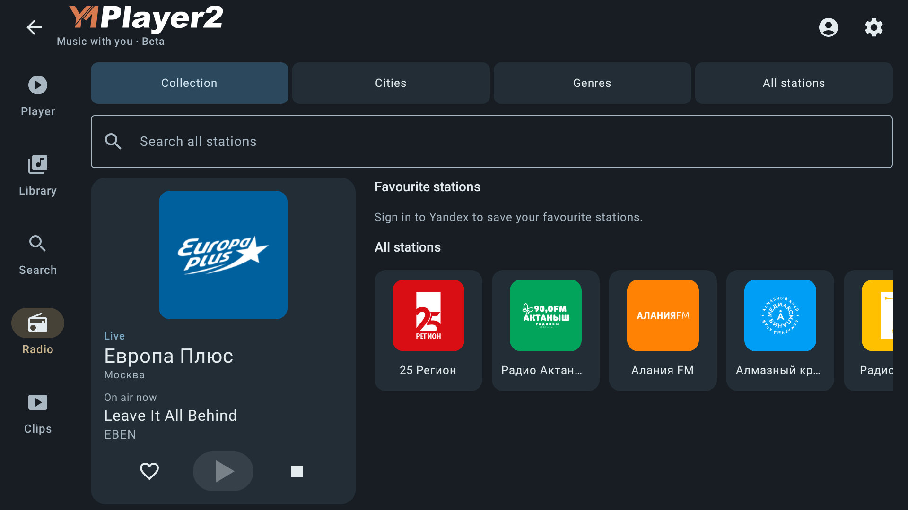

# Восстановление сеанса в 2.5

Задача владельца от 6 октября 2026: сохранить выбранный раздел, последний
источник (музыка/радио/клип), состояние воспроизведения и позицию после выхода,
завершения процесса и выключения устройства. Продолжать при следующем явном
запуске приложения. Прежняя политика восстановления на паузе изменена этим
требованием; исторические проверки M12.7 и beta87 описывают прежний контракт.

## Найдено в beta87

- ShellApp хранит route только в rememberSaveable; force-stop не сохраняет Bundle.
- Music сохраняет очередь/позицию, но восстанавливает их на паузе.
- Radio сохраняет станцию без play intent и после рестарта остаётся остановленным.
- ClipActivity сохраняет плеер при повороте, но у клипа нет постоянного checkpoint.

## Реализация

LaunchStateStore отделяет владельца выхода от очереди Music. Только явный
запуск MainActivity запрашивает автоматическое продолжение. Повторное создание
экрана не запускает второй сеанс; после уничтожения аудиосервиса следующий
запуск может восстановить аудио и в том же процессе. Создание AudioService/
запрос метаданных не включает музыку само по себе. Уже живой ClipActivity не
создаётся повторно; после закрытия он восстанавливается только при новом
запуске с сохранённым разделом «Клипы», а не при повороте другого раздела.
Навигация сохраняется отдельно: основной раздел, выбранные источники медиатеки/
поиска, вкладка/запрос/фильтр Радио внутри профиля. Музыкальный checkpoint используется повторно,
позиция записывается раз в секунду. Radio запрашивает свежий поток той же станции;
seek у прямого эфира нет. ClipCheckpoint содержит идентификатор клипа/плеера,
подписи, session/batch, позицию и намерение play/pause. Токены и разрешённый URL
полного видео не сохраняются: перед playback поток разрешается заново. Для
клипов-превью без playerId сохраняется публичная previewUrl из API-описания;
как и сам клип, она может стать недоступной. Автоматическая пауза видео в фоне
не подменяет сохранённое намерение пользователя; явная Pause/Close подменяет.

Выбор клипа ставит музыку на паузу через существующий gate команд, включая
незавершённое восстановление и возвращение после включения музыки в фоне.
Radio и клип не запускают старую очередь Music. Клип старого профиля закрывается
при возврате после смены профиля; его callbacks не перехватывают новый выход Music.
При выходе выполняется fence записей preferences; принудительное завершение
использует последний уже записанный checkpoint. Это не гарантия против потери
питания до физического сохранения данных ОС.

Возврат в уже существующий MainActivity также восстанавливает аудио, если
служба была уничтожена в фоне. Пока служба жива, повторный onStart не отменяет
пользовательскую паузу. Music сохраняет playWhenReady, а не временный isPlaying:
буферизация/подавление звука не должны потерять намерение продолжения.

## Проверки

Добавлены SessionRecoveryTest и tools/check-session-recovery.ps1: отдельные
seed/verify процессы для MUSIC/RADIO/CLIPS, playing true/false, force-stop/reboot.
Каждое состояние проверяется на Android9/API28 и TV10/API29. Перед финальными
дополнениями все6 состояний после force-stop и все6 после reboot прошли на
обоих стендах. Финальный повтор и подписанная сборка фиксируются ниже.

Первый расширенный прогон обнаружил ошибки подготовки прежних тестов:
LocalPlayback/RadioLive ожидали начальный «Плеер», хотя теперь сохраняется
выбранный раздел. Фикстуры явно выбирают начальный экран. Phone ClipRemote
посылал событие до получения фокуса окна; тест ждёт hasWindowFocus.
Исправленные Local/Radio проверки прошли на обоих стендах; повтор ClipRemote
и preview-only клипа также прошёл (3/3 на каждом). Другие классы расширенного
прогона не падали. Эти начальные ошибки не названы дефектами приложения.

Кандидаты88–91 собраны локально, но не публиковались: после них обнаружились
дополнительные переходы профиля, живого сервиса/видео и preview-only клипов.
Номера не переиспользуются; окончательный APK выделяется после завершения кода.

Живое радио проверяется публичной станцией Europa Plus, без записи коллекции.
Клипы проверяются настоящим MP4/Media3 через контролируемый ClipTransport,
без токена владельца. Это не приёмка живого аккаунта или K4811.

### Финальный код и стендовые результаты — 7 октября

- Debug APK/test APK собраны; 105 core + 4 app JVM-теста, 0 failures/errors.
- Release lint: 0 ошибок, 64 предупреждения (включая синхронные fences
  preferences при уходе с экрана; предупреждения не скрыты).
- SessionRecovery + ClipHandoff на каждом эмуляторе: 13 пройдены, 2 служебных
  seed/reset метода пропущены в обычном запуске (runner показывает15).
- Финальная матрица force-stop: все6 состояний на API28 и TV29 прошли.
  MUSIC/RADIO подтверждают выбранный Search на реальном Compose-экране;
  радио также сохраняет All/query, клип — позицию и play/pause в Media3.
- Матрица reboot до последних дополнительных lifecycle-правок: все6 состояний
  на обоих эмуляторах прошли. Последние изменения затрагивают возврат в живую
  Activity и intent при временном подавлении, не меняя дисковый формат.
- Расширенная регрессия: 57 runner-тестов на каждом стенде; исходно4/5 ошибок
  фикстур. Адресный повтор Local/Radio и затем ClipRemote/preview подтвердил
  исправления. Первые неудачные логи сохранены с объяснением выше.

[Машинная сводка](qa/session-recovery-2026-10-07/checks.json),
[lifecycle TV29](qa/session-recovery-2026-10-07/final-lifecycle-5556.txt),
[API28](qa/session-recovery-2026-10-07/final-lifecycle-5560.txt),
[финальная force-stop TV29](qa/session-recovery-2026-10-07/release-final-5556.txt),
[API28](qa/session-recovery-2026-10-07/release-final-5560.txt).

Последний повтор reboot радио на окончательном коде также прошёл на обоих
эмуляторах: станция продолжила эфир, вкладка и запрос восстановились.
[TV29](qa/session-recovery-2026-10-07/release-boot-5556.txt),
[API28](qa/session-recovery-2026-10-07/release-boot-5560.txt).

## Подписанный APK и выпуск92

Подписанный R8 APK **2.5.0beta-build92**, minSdk28/target36, прежний пакет
`dev.petrov.ymplayer2` и сертификат SHA256
`fbc7f884d76568e5b5f7be16e83b4a39f1fedad334ebd0be7fba7aa0bea406ec`.
APK SHA256 `c145e62e6c6a1f3f85fde767a8d83f0a412cb057bb1b99b4def9a1443441b911`.
Исходники и immutable APK: commit `6cc9eb342f83ca968e84331f779ac127c47926f1`.
[Сборка](qa/session-recovery-2026-10-07/build92.txt).

Установка87→92 без удаления данных прошла на обоих эмуляторах. Сохранились
английский язык, Oxide на телефоне/Blue на TV и прежняя Europa Plus.
Публичный HLS: Play → force-stop → открытие восстановили тот же эфир с
MediaSession PLAYING; экранный Stop → force-stop → открытие сохранили станцию
без воспроизведения. Системная сессия при Stop имеет NONE/0, а не ожидавшийся
первым скриптом STOPPED/1; ожидание исправлено, продукт не менялся.
[TV29](qa/session-recovery-2026-10-07/emulator-5556-signed-runtime.json),
[API28](qa/session-recovery-2026-10-07/emulator-5560-signed-runtime.json).

Ручной prerelease92 в той же main; APK/build.json/SHA256.txt/signature.txt.
GitHub latest/оба stable feeds остаются84. Поле runtimeAcceptance=pending
в build.json относится к приёмке владельцем на физических устройствах;
оно не отменяет выполненные эмуляторные проверки. Публикация/HTTP-сверка
фиксируются отдельным датированным свидетельством после загрузки assets.

## Остаточные границы

Музыка при внезапной смерти процесса использует последний записанный секундный
checkpoint; полноценное обесточивание до записи ОС не гарантируется.
Радио восстанавливает live edge, а не старый момент эфира. Недоступная сеть,
USB, истёкший вход или удалённый клип могут помешать playback. Сохраняются
основной раздел и выбранные источники, но не scroll-offset и временная карточка
артиста (возврат в родительский раздел). Смена профиля оставляет входящий
профиль на паузе; не возобновляет его старый источник автоматически.

Живой авторизованный клип владельца, физические reboot/питание K4811/телефона
и запись FM-коллекции не проверены этой задачей. Обновление старой beta87
не может восстановить ранее не сохранявшиеся play intent/clip checkpoint;
после использования92 эти признаки сохраняются.
