# YMPlayer 2 — руководство пользователя

Для **2.2.0-build71**. В 2.2 появился выбор языка; обновление устанавливается
поверх предыдущей 2.1.5 с сохранением данных.
Обновлено 2 октября 2026 года.

YMPlayer 2 воспроизводит музыку устройства и USB, музыку Яндекса и клипы.
Можно пользоваться несколькими профилями, сохранять понравившиеся треки для
прослушивания без сети и менять оформление. Для локальной музыки вход не нужен.

[Скачать текущий APK](https://github.com/reziarlleh/YMPlayer2/releases/latest) ·
[Обсуждение и APK на 4PDA](https://4pda.to/forum/index.php?showtopic=1127108) ·
[На главную репозитория](../README.md)

## Содержание

- [Установка и первый запуск](#установка-и-первый-запуск)
- [Как устроен интерфейс](#как-устроен-интерфейс)
- [Кнопки и их состояния](#кнопки-и-их-состояния)
- [Главный экран плеера](#главный-экран-плеера)
- [Медиатека, папки и поиск](#медиатека-папки-и-поиск)
- [Вход в Яндекс и профили](#вход-в-яндекс-и-профили)
- [Моя музыка, рекомендации и волна](#моя-музыка-рекомендации-и-волна)
- [Лайки, запреты и любимые альбомы](#лайки-запреты-и-любимые-альбомы)
- [Очередь и плейлисты](#очередь-и-плейлисты)
- [Музыка без интернета](#музыка-без-интернета)
- [Качество звука и эквалайзер](#качество-звука-и-эквалайзер)
- [Клипы](#клипы)
- [Язык приложения](#язык-приложения)
- [Оформление и скины](#оформление-и-скины)
- [Боковая панель K4811](#боковая-панель-k4811)
- [Обновления](#обновления)
- [О приложении и поддержка разработки](#о-приложении-и-поддержка-разработки)
- [Настройки — быстрый справочник](#настройки--быстрый-справочник)
- [Если что-то не работает](#если-что-то-не-работает)

## Установка и первый запуск

Нужен Android 10 или новее. На телефоне, планшете, Android TV и магнитоле
используется один APK; расположение элементов подстраивается под экран.

1. Скачайте APK из текущего выпуска на GitHub или из шапки темы 4PDA.
2. Откройте файл. Если Android запросит разрешение установки из этого источника,
   разрешите его для приложения, через которое открываете APK, и вернитесь к установке.
3. Запустите **YMPlayer 2**.
4. Для своих файлов откройте **Медиатека → Общий каталог → Папки с музыкой** и добавьте папку.
   Для Яндекс Музыки выберите профиль и выполните вход по коду.

YMPlayer 2 — самостоятельная новая ветка, не обновление 1.x. Старое приложение
для её работы не требуется. Авторизация, настройки, списки, кэш и канал обновлений
независимы. При одновременной установке версии не конфликтуют.
Переносить токен из старого приложения не требуется.

При обновлении устанавливайте новый APK поверх существующего приложения.
Удаление приложения перед обновлением удалит его собственные данные.

## Как устроен интерфейс

В основном меню четыре раздела:

| Раздел | Что внутри |
| --- | --- |
| **Плеер** | Текущий трек, обложка, время, управление воспроизведением, волна и очередь. |
| **Медиатека** | Музыка устройства/USB и Яндекса, альбомы, исполнители, плейлисты и офлайн-кэш. |
| **Поиск** | Поиск по выбранному источнику; для офлайн ищет только в сохранённом кэше профиля. |
| **Клипы** | Персональный поток музыкальных клипов Яндекса. |

Верхняя строка с логотипом, профилями и настройками занимает всю ширину экрана.
В портретной ориентации меню находится внизу, на широком экране — слева,
под верхней строкой. Отдельного логотипа в левом меню нет.
На очень низком экране подписи могут скрываться, чтобы оставалось место для содержимого.
Значок человека в верхней части открывает **Профили**, шестерёнка — **Настройки**.
Нажатие на широкий логотип **YMPlayer2** открывает окно **О приложении**.

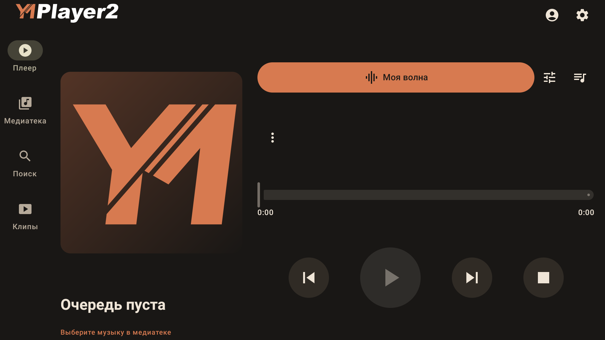

*2.1.4-build68 на проектном TV29; очередь пуста, вместо обложки показана заглушка.*

  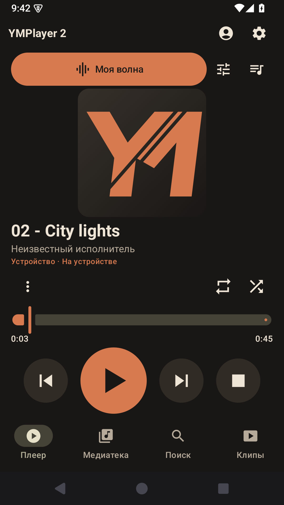
  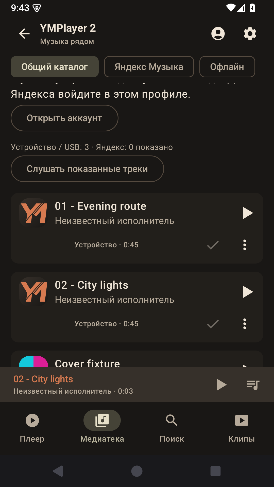

*Снимки стабильной сборки 2.1.0-build64 на проектном эмуляторе Android 15.
Музыка на снимках служит примером; ваша медиатека будет своей.*

На других страницах над основным меню появляется **мини-плеер**: название,
исполнитель, позиция, воспроизведение/пауза и переход к очереди. Нажмите на
название, чтобы вернуться к полному плееру.

**Назад** поднимает на уровень выше. Например, со страницы качества — в настройки,
из аккаунта — к профилям, из вложенного списка — к медиатеке. На главном плеере
для закрытия интерфейса нажмите «Назад» дважды в течение двух секунд.
Закрытие интерфейса и кнопка «Стоп» — разные действия: фоновое воспроизведение
управляется также из системного уведомления и медиакнопками.

На Android TV перемещайтесь стрелками пульта, выбирайте центральной кнопкой.
На прогрессбаре **←/→** перематывают, **↑/↓** переводят фокус на другие элементы.
При вертикальном входе в строку выбора фокус попадает в текущий пункт; он остаётся
доступным, даже если уже выбран. **←/→** переходят между вариантами, а **OK**
меняет выбор. Само перемещение фокуса не меняет фильтры и не включает музыку.
Выделенная рамка показывает текущий фокус. Для редактирования порядка используйте
доступные кнопки перемещения; сенсорное перетаскивание пульту не требуется.

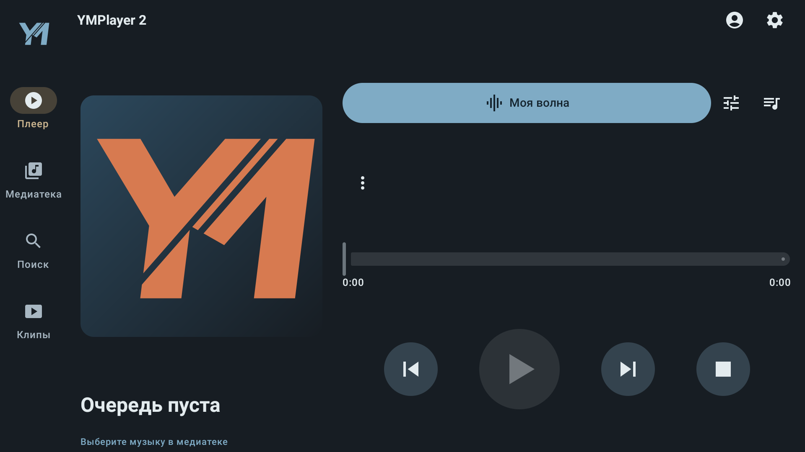

*2.1.0-build64 на проектном эмуляторе TV 29, скин «Гавань».*

## Кнопки и их состояния

Ниже показаны обычные значки базового оформления. Пользовательский скин может
изменить их рисунок и цвета, сохранив назначение.

| Значок | Что делает |
| :---: | --- |
|  /  | Начать или продолжить воспроизведение / поставить на паузу. |
|  /  | Перейти к предыдущему / следующему треку. |
|  | Остановить воспроизведение. |
|  | Открыть текущую очередь. |
|  | Добавить трек в очередь. |
|  | **В карточке трека:** трек уже есть в очереди. Это не отметка скачивания и не лайк. **В диалоге выбора/редактирования:** выбранный вариант или завершение редактирования. |
|  | Случайный порядок обычного списка. Выделение показывает включённый режим. |
|  /  | Повтор списка / повтор одного трека. Без выделения повтор выключен. |
|  | Открыть выбранный внешний эквалайзер или DSP. |
|  | Дополнительные действия. Состав меню зависит от трека и источника. |
|  /  | Сердце без заливки — лайк не установлен; залитое — объект уже в любимых. Нажатие меняет отметку. |
|  /  | Запрет рекомендаций для трека или исполнителя. Активный значок и выделение показывают установленный запрет. |
|  | Состояние отметок ещё не получено. Это не означает «лайка нет». Дождитесь загрузки или повторите запрос. |
|  | Выбор профиля и вход в Яндекс для него. |
|  | Настройки приложения. |
|  | Включить редактирование списка или изменить название — в зависимости от страницы. |
|  | Создать список или добавить треки — рядом указано действие. |
|  /  | Передвинуть элемент списка на одну позицию. |
|  | Убрать трек из списка или удалить сам список. Аудиофайлы этим не удаляются. |
|  | Ручка перетаскивания в редакторе плейлиста Яндекса. |
|  | Подняться на уровень выше. |

Серые недоступные кнопки означают, что действие сейчас выполнить нельзя:
например, нет трека, идёт запрос или ещё не получены отметки аккаунта.

## Главный экран плеера

В центре — обложка, название и исполнитель текущего трека. Под ними указаны
источник, прошедшее и полное время. Ползунок перематывает трек к выбранной позиции.
Большая центральная кнопка включает воспроизведение или паузу; рядом находятся
предыдущий трек, следующий и стоп.

В верхнем ряду доступны **Моя волна**, **эквалайзер / DSP** и **очередь**.
В обычных списках также доступны случайный порядок и повтор. В «Моей волне»
эти две кнопки скрыты: следующие треки подбирает Яндекс, а не перемешивание списка.

У трека Яндекса есть лайк и запрет. Нажатие на имя исполнителя открывает его
карточку с популярными треками и альбомами. Если исполнителей несколько,
действия для каждого можно открыть через **⋮**. Там же находятся отметки альбома
и добавление трека в плейлист Яндекса.

Через **⋮** можно выбрать источник/папки и внешний эквалайзер. Сообщение об ошибке
на плеере можно открыть для просмотра подробностей.

## Медиатека, папки и поиск

### Музыка устройства и USB

1. Откройте **Медиатека → Общий каталог → Папки с музыкой**.
2. Нажмите **Добавить с устройства** или **Добавить с USB / SD**.
3. В системном окне выберите папку и подтвердите доступ.
4. Дождитесь чтения аудиофайлов. Музыка появится в общем каталоге.

Приложение читает выбранные папки; исходные файлы остаются на своём месте.
После добавления или удаления музыки нажмите **Обновить каталог**.
**Убрать из медиатеки** удаляет только подключение папки — не файлы на носителе.
Папки устройства общие для всех профилей.

В медиатеке выбирайте треки, альбомы, исполнителей, жанры, папки или плейлисты.
Фильтр источника позволяет оставить устройство, USB или все источники.
**Доступные сейчас** исключает недоступные записи, **Доступно офлайн** оставляет
музыку, которую можно слушать без сети. Стрелка у **Название ↑/↓** меняет сортировку.
Жанры и папки относятся к устройству/USB.

Название и исполнитель в карточке относятся к одному треку. Под ними находятся
источник и длительность, действия с очередью и меню. Нажмите воспроизведение у
нужного трека или кнопку воспроизведения показанного списка.

### Поиск

Откройте **Поиск**, введите название, исполнителя или альбом и выберите источник:

| Источник | Где ищет |
| --- | --- |
| **Общий каталог** | В подключённой музыке устройства/USB и доступных результатах общего каталога. Можно уточнить источник фильтрами. |
| **Яндекс Музыка** | В онлайн-каталоге Яндекса; выберите тип результата: треки, исполнители, альбомы или плейлисты. Нужен вход. |
| **Офлайн** | Только в скачанных «Мне нравится» текущего профиля. Поиск остаётся на своей странице. |

Запрос сохраняется при переключении источника. Для нового запроса очистите поле
кнопкой **×**. Если результатов много, кнопка **Показать ещё / Загрузить ещё**
открывает следующую часть списка. Это продолжение выдачи, а не отдельный плейлист.

## Вход в Яндекс и профили

### Авторизация по коду

1. Нажмите значок профиля. Выберите **Основной** или **В дороге**.
2. Нажмите **Яндекс · имя профиля**, затем **Получить код входа**.
3. **Запишите показанный код до открытия браузера.** На странице Яндекса
   вставка из буфера доступна не всегда. На экране также видны адрес и срок действия кода.
4. Нажмите **Открыть Яндекс**. Можно открыть показанный адрес на другом устройстве.
5. Войдите в нужный аккаунт Яндекса, введите код и разрешите вход.
6. Вернитесь в плеер и дождитесь **Вход выполнен**.

Пароль вводится на стороне Яндекса; вводить его в YMPlayer 2 не нужно.
Открытие профиля в браузере само по себе ещё не является подтверждением входа
в приложении — дождитесь результата на странице аккаунта плеера.

Пока код действует, приложение ожидает подтверждение. **Отменить вход**
прекращает ожидание. Если код истёк, получите новый.
При ошибке загрузки имени аккаунта используйте **Обновить сведения об аккаунте**.

### Переключение профилей

Доступны **Основной**, **В дороге** и **Гость**. Выбирайте нужный профиль на
странице профилей; после переключения открывается плеер, воспроизведение ставится
на паузу и восстанавливается очередь выбранного профиля.

| Общее | Отдельное для профиля |
| --- | --- |
| Подключённые локальные папки и их каталог; оформление; настройки качества звука. | Очередь и позиция; локальные плейлисты и избранное; вход в Яндекс и привязанный офлайн-кэш. |

**Гость** слушает локальную музыку без аккаунта. Для входа в Яндекс переключитесь
на другой профиль. В двух обычных профилях можно войти под разными аккаунтами.
Если войти в один и тот же аккаунт, серверные лайки и плейлисты у него, разумеется,
останутся общими: это данные аккаунта Яндекса.

**Выйти из аккаунта** (или **Удалить сохранённый вход** на странице ошибки)
удаляет вход текущего профиля после подтверждения. Локальные файлы, очередь и
локальные плейлисты сохраняются. Для другого профиля вход не удаляется.

## Моя музыка, рекомендации и волна

В **Медиатеке → Яндекс Музыка** доступны **Мне нравится**, **Любимые исполнители**,
**Любимые альбомы**, **Мои плейлисты** и **Рекомендации**. Из общего каталога туда
также ведёт кнопка **Моя музыка и рекомендации Яндекса**.

Карточка исполнителя открывает популярные треки и альбомы. Откройте альбом или
плейлист, чтобы увидеть его треки. **Слушать показанные треки** запускает список;
кнопка у конкретного трека начинает с него.

**Моя волна** запускается с плеера и подбирает музыку для вошедшего аккаунта.
Следующий трек готовится во время текущего. Можно ставить на паузу, продолжать,
пропускать треки и менять отметки. Случайный порядок и повтор обычной очереди
к волне не применяются. Для прослушивания списка выберите альбом, плейлист или
сохранённые треки и запустите его — снова будут доступны обычные режимы порядка.

## Лайки, запреты и любимые альбомы

Отметка всегда относится к тому объекту, рядом с которым показана:

| Где нажали | Сердце | Дизлайк / «Никогда не предлагать» |
| --- | --- | --- |
| **У трека** | Добавляет именно трек в «Мне нравится». Повторное нажатие убирает лайк. | Запрещает предлагать этот трек. Повторное нажатие снимает запрет. |
| **У исполнителя** — в карточке или меню ⋮ | Добавляет исполнителя в «Любимые исполнители». | Запрещает предлагать исполнителя. В меню можно выбрать «Снова предлагать исполнителя». |
| **У альбома** | Добавляет альбом в «Любимые альбомы». | Запрет альбома не предлагается. |

Лайк исполнителю не ставит лайки всем его трекам. Лайк альбому также не добавляет
все треки в «Мне нравится». Для офлайн-синхронизации важны именно лайки треков.
Дизлайк задаёт запрет рекомендаций; это отдельная операция от снятия лайка.

Состояние кнопок читается с сервера. **?** означает, что оно ещё неизвестно;
подождите или нажмите **Проверить отметки / Обновить отметки**, если появилось
сообщение об ошибке. Изменения учитываются в вошедшем аккаунте Яндекса.

Локальное **Избранное** — другой список: для трека устройства откройте **⋮ → В избранное**.
Он принадлежит текущему профилю и не ставит лайк в Яндексе.

## Очередь и плейлисты

### Очередь воспроизведения

Значок **список с плюсом** добавляет трек в текущую очередь. Появившаяся вместо
него **галочка** означает, что он уже там. Просмотреть список можно кнопкой очереди
на плеере или мини-плеере.

Нажмите карандаш **Изменить очередь**, чтобы передвигать треки стрелками и убирать
их. Галочка **Завершить редактирование** возвращает обычный режим.
**Очистить очередь** очищает весь список. Удаление текущего трека ставит
воспроизведение на паузу. Изменение очереди не удаляет треки из сохранённых плейлистов.

### Локальные плейлисты

Откройте **Медиатека → Общий каталог → Плейлисты**.

- **+** создаёт плейлист: введите название и нажмите **Сохранить**.
- Карандаш рядом с названием в общем списке переименовывает плейлист.
- Откройте плейлист и нажмите **+**, чтобы добавить треки. В окне выбора есть поиск;
  галочка показывает уже добавленный трек. **Готово** закрывает выбор.
- Карандаш внутри плейлиста включает изменение порядка и удаление треков.
  Передвигайте их стрелками вверх/вниз; завершите режим галочкой.
- **Воспроизвести список** запускает весь плейлист; выбор трека начинает с него.
- Удаление плейлиста требует подтверждения и не удаляет аудиофайлы.

Добавить локальный трек можно и через его меню **⋮ → В плейлист**.
Локальные списки принадлежат выбранному профилю. Если USB отключён, ссылки на
файлы сохраняются; для воспроизведения снова подключите носитель и проверьте доступ.

### Плейлисты Яндекса

В **Медиатека → Яндекс Музыка → Мои плейлисты** можно создать собственный
приватный плейлист. Для добавления трека откройте его **⋮ → Добавить в плейлист
Яндекса** и выберите список или создайте новый.

Откройте свой плейлист и нажмите **Редактировать плейлист**:

- **Переименовать** → новое название → **Сохранить название**.
- Удерживайте ручку перетаскивания у трека и переместите его. Возле края список
  прокручивается. После отпускания изменение отправляется в Яндекс.
- На пульте или для точного переноса используйте **Позиция**: укажите номер
  от 1 до размера списка и нажмите **Переместить**.
- Кнопка удаления у трека → **Убрать трек** удаляет выбранное вхождение;
  другие вхождения этого же трека сохраняются.
- **Обновить плейлист** повторно получает список с сервера.

Переименование, добавление, удаление и перенос сохраняются по выполнении команды;
отдельной общей кнопки «Сохранить всё» нет. Дождитесь результата запроса.
Редактировать чужой или рекомендованный плейлист нельзя.
**Удалить плейлист Яндекса** удаляет ваш список из аккаунта на всех устройствах
после подтверждения; текущая очередь и «Мне нравится» сохраняются.

## Музыка без интернета

Параметры и синхронизация находятся в **Настройки → Настройки офлайн-кэша**.
Здесь можно включить или выключить кэш, выбрать загрузку только по Wi-Fi,
начать или остановить синхронизацию и удалить сохранённые файлы. Списка треков
на этом экране нет; «Назад» возвращает в настройки.
Войдите в Яндекс для выбранного профиля, если ещё не сделали этого.

Для прослушивания откройте **Медиатека → Офлайн**. Здесь находятся только
сохранённые треки, счётчик и кнопка **Слушать сохранённое**. Настроек и очистки
в списке нет; «Назад» возвращает в медиатеку.

**Включить офлайн-кэш** разрешает использовать постоянный кэш на этом устройстве.
На телевизоре с небольшим объёмом памяти и постоянным интернетом его можно
выключить. Настройка сохраняется после перезапуска и действует для всех профилей.
По умолчанию прежнее поведение сохранено: кэш доступен, но загрузка начинается
только после команды синхронизации.

При выключении текущая синхронизация останавливается, новые загрузки не
запускаются и сохранённая музыка не используется для новых запросов воспроизведения.
Онлайн-музыка и предзагрузка волны работают дальше. Уже скачанные файлы остаются:
чтобы освободить место, нажмите **Удалить офлайн-файлы** — эта команда доступна
и при выключенном кэше. Повторное включение возвращает доступ к оставшимся файлам.

1. Включите **Включить офлайн-кэш**, если он выключен.
2. Проверьте переключатель **Загружать только по Wi-Fi**. Если хотите загружать
   через мобильную сеть, выключите его.
3. Нажмите **Синхронизировать «Мне нравится»**.
4. Дождитесь загрузки. Счётчик показывает сохранённые треки и занятое место.
   **Остановить синхронизацию** останавливает текущую работу.
5. Откройте **Медиатека → Офлайн** и нажмите **Слушать сохранённое** или выберите трек.

Синхронизируются **только понравившиеся треки и их обложки**. Любимые исполнители,
любимые альбомы и остальные плейлисты целиком не скачиваются автоматически.
Для новых лайков повторите синхронизацию. При отдельных ошибках загрузки
повторная синхронизация позволяет догрузить недостающее.

  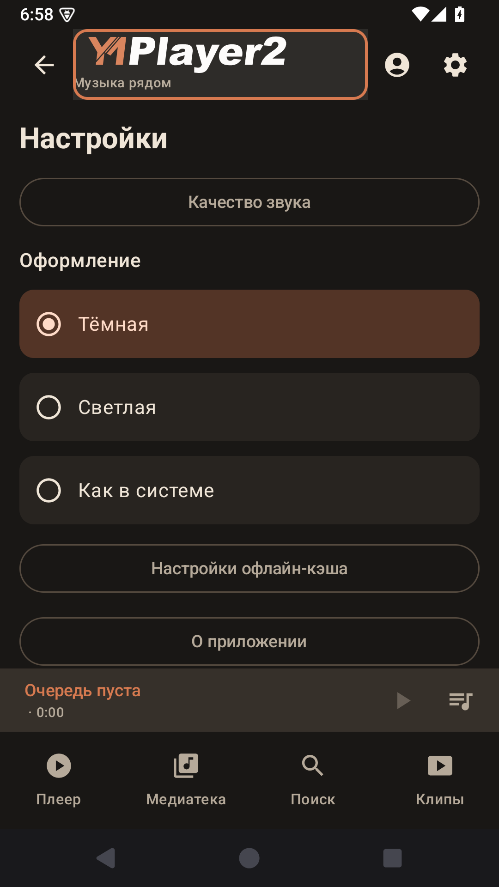
  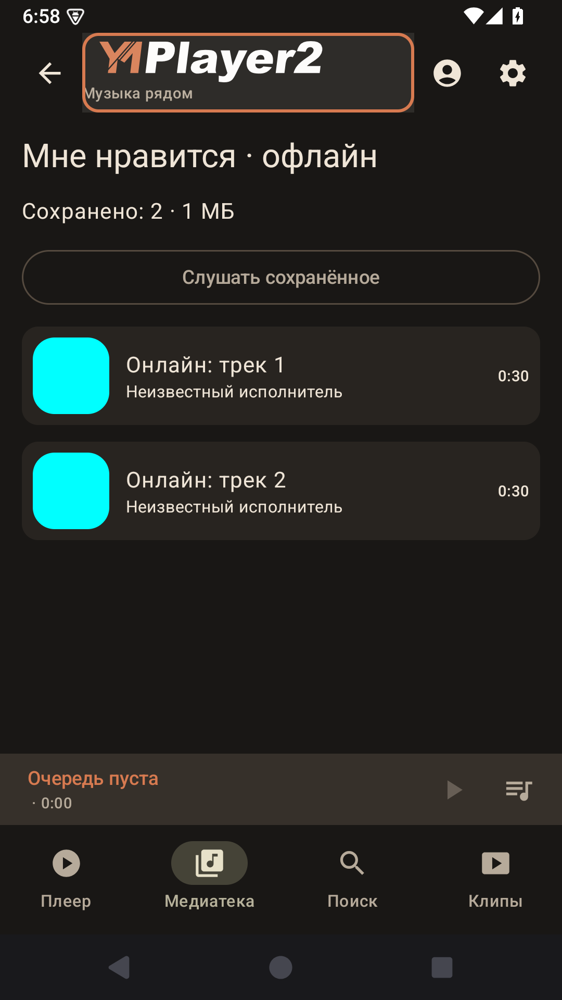

*2.1.5, проектный эмулятор Android 15. Изолированный тестовый профиль с двумя
WAV-треками и голубыми тестовыми обложками; дополнительные production-настройки
не подключены в этом тестовом экране.*

**Поиск → Офлайн** ищет в этом кэше. Подключённые локальные файлы также можно
слушать без сети, но они находятся в общем каталоге и не копируются в кэш Яндекса.

**Удалить офлайн-файлы** очищает кэш и обложки текущего профиля/аккаунта после
подтверждения. Лайки на сервере остаются. Сохранённые треки другого аккаунта
не подменяют кэш текущего входа.

## Качество звука и эквалайзер

**Настройки → Качество звука** содержит два независимых выбора:

| Настройка | На что влияет |
| --- | --- |
| **Онлайн-воспроизведение** | Новые потоки Яндекса и предзагрузка следующих треков волны. |
| **Офлайн-кэш «Мне нравится»** | Новые скачивания в постоянный офлайн-кэш. |

Варианты: **Авто**, **Экономия · 128 кбит/с**, **Стандарт · 192 кбит/с**,
**Высокое · 320 кбит/с**, **Максимальное**. Доступное качество зависит от файлов,
которые возвращает Яндекс: выбранное число не означает перекодирование любого
трека в этот битрейт. «Авто» и «Максимальное» выбирают лучшее доступное качество;
ограниченные режимы выбирают ближайший подходящий вариант.

Текущий трек, уже подготовленные файлы волны и скачанный кэш не переписываются
при смене настройки. Чтобы заново скачать весь кэш в другом качестве, измените
качество, удалите офлайн-файлы и повторите синхронизацию. Настройки качества
общие для устройства, а не отдельные для каждого профиля.

Кнопка **эквалайзер / DSP** на плеере открывает выбранное внешнее приложение или
доступную системную панель. Через **⋮ → Выбрать эквалайзер / DSP** можно выбрать
другой обработчик. Сам YMPlayer 2 не предоставляет встроенный многополосный эквалайзер.

## Клипы

Раздел **Клипы** запускает поток клипов для аккаунта Яндекса. Нужны вход и сеть.
Аудиоплеер и видеоплеер не воспроизводят два источника одновременно.

Нажмите на видео, чтобы показать или скрыть управление. Во время воспроизведения
панель автоматически скрывается через пять секунд. При паузе и ошибке остаётся видимой.

- Центральная кнопка — воспроизведение/пауза.
- Левая — предыдущий клип, когда он доступен; правая — следующий.
- **СЕЙЧАС** показывает название и исполнителя текущего клипа.
- **ДАЛЕЕ** показывает следующий клип. Пока он ещё не определён, так и написано.
- Затемнение фона **СЕЙЧАС** растёт слева направо по мере воспроизведения.
  Оно показывает долю прошедшего времени; фон **ДАЛЕЕ** не меняется.
- **Повторить** появляется при ошибке.
- **← Назад** возвращает из видеоплеера.

Поворот экрана сохраняет текущий клип и позицию воспроизведения.
Надпись **Предпросмотр**, если она показана, означает доступный предпросмотр клипа.

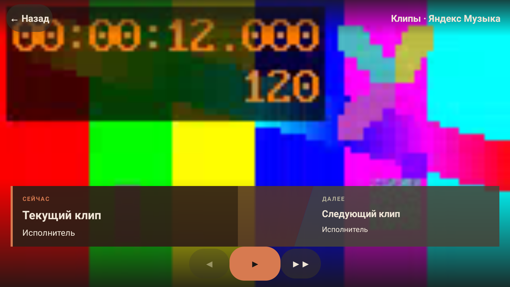

*Интерфейс 2.1.1 на проектном эмуляторе TV29. Воспроизводится локальное
тестовое видео, названия служат примерами; панель показывает прогресс 75%.*

На пульте стрелки перемещают фокус по кнопкам, **OK / центральная кнопка**
выполняет выбранное действие. Если панель скрыта, первое нажатие стрелки или
OK показывает её и выделяет play/pause; следующее нажатие выполняет команду.
Кнопки пульта **Play**, **Pause**, **Play/Pause**, **Next** и **Previous**
управляют воспроизведением напрямую, даже при скрытой панели. **Назад** закрывает видеоплеер.

## Язык приложения

В **2.2.0-build71** откройте **Настройки → Язык приложения**
(**Settings → App language** в English).

- **Авто — как в системе / Auto — system language** — первый пункт и значение
  по умолчанию. Если среди языков системы нет поддерживаемого, используется English.
- **English (English)** — английский интерфейс.
- **Russian (Русский)** — русский интерфейс.

Выбор общий для устройства, сохраняется после закрытия и перезапуска приложения.
Текст меняется сразу; воспроизведение, профиль, очередь, качество и настройки
кэша сохраняются. Названия музыки, пользовательских плейлистов и скинов остаются
исходными. Остальные языки появятся после проверки первого английского пакета.

  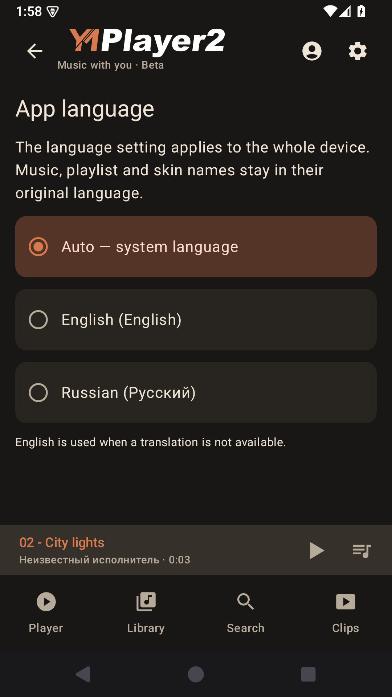
  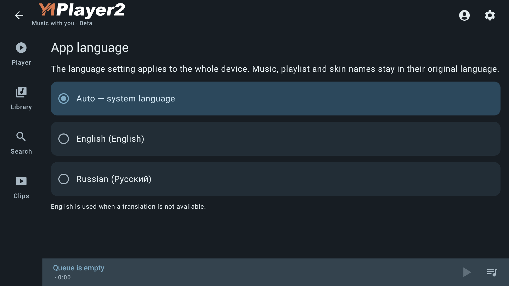

*Подписанный 2.2.0beta-build70 на проектных эмуляторах Android 15 и TV29.*

## Оформление и скины

Режим **Тёмная / Светлая / Как в системе** выбирается в **Настройки → Оформление**.
Он определяет, какую часть палитры использовать. Скин задаёт саму палитру и
допустимые значки. Эти настройки можно менять независимо друг от друга.

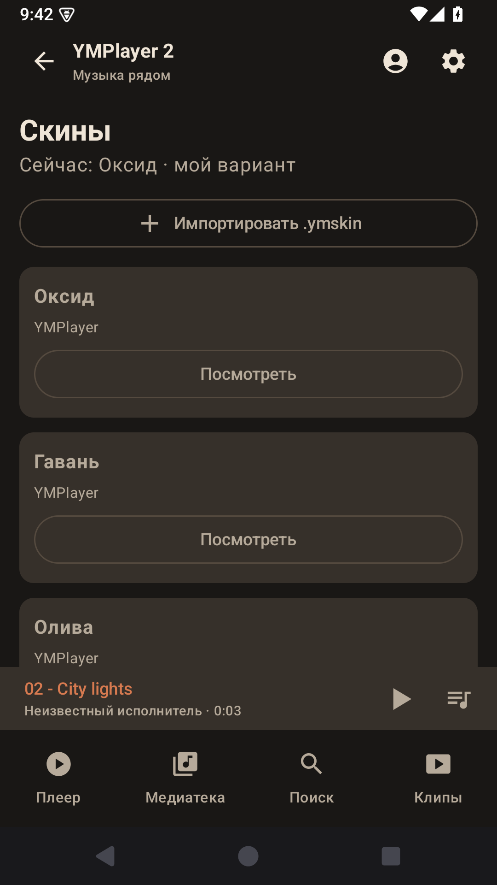

*Список скинов в 2.1.0-build64; дополнительно импортирован учебный пакет.*

### Готовые варианты

Откройте **Настройки → Скины**. Встроены **Оксид**, **Гавань**, **Олива** и
**Серебро**, каждый с тёмной и светлой палитрой.

1. Нажмите **Посмотреть** у нужного скина.
2. В предпросмотре проверьте **Тёмный** и **Светлый** варианты.
3. Нажмите **Применить**, чтобы выбрать скин, либо **Отмена**, чтобы оставить текущий.

Переключение тёмного/светлого варианта внутри предпросмотра меняет только просмотр.
Общий режим приложения выбирается отдельно в настройках оформления.
Выбранный скин сохраняется после перезапуска. **Вернуть «Оксид»** возвращает базовое оформление.

### Импорт своего скина

1. Скачайте файл **.ymskin** — например, из [набора готовых пакетов](../skins/README.md).
   Не распаковывайте его для установки в приложение.
2. Нажмите **Импортировать .ymskin** и выберите файл в системном окне.
3. Проверьте предпросмотр и нажмите **Применить**.

Ошибочный пакет не заменяет активное оформление. Для удаления импортированного
скина сначала переключитесь на другой, затем нажмите **Удалить** у ненужного
пакета и подтвердите. Исходный файл в Downloads остаётся на месте.

Скин меняет цвета и поддерживаемые иконки интерфейса. Он не переставляет кнопки
и не меняет их действия. Значок запуска и плитка Android TV сохраняют официальный
логотип; белая панель K4811 также использует своё оформление.
Для создания собственного пакета есть отдельное
[руководство автора скинов](SKIN_AUTHOR_GUIDE.md) с шаблоном и форматом.

## Боковая панель K4811

Эта функция предназначена для магнитолы **K4811**. Настройки находятся в
**Настройки → Боковая панель**.

1. Нажмите **Разрешить показ поверх приложений**, если разрешения ещё нет.
2. Выберите нужные кнопки и включите **Включить панель**.
3. Открывайте панель коротким свайпом от середины левого или правого края
   либо от центра нижнего края. Зона жеста невидима и занимает небольшую часть края.

Можно отдельно включить громкость +/−, mute, плей/паузу, домой, меню, назад,
сон и перезагрузку. **Меню** открывает список приложений K4811;
**Плей / пауза** управляет активным плеером; **Сон** усыпляет магнитолу,
**Перезагрузка** запрашивает подтверждение.

**Спрятать сайдбар** всегда последняя кнопка. Если выключить все остальные,
панель отключается. Переключатель **Сворачивать через 8 секунд** включает
автоматическое скрытие; **Показать / скрыть панель** позволяет проверить её вручную.
Фон панели полупрозрачный, кнопки белые; оформление музыкального скина его не меняет.

## Обновления

Откройте **Настройки → Обновление приложения**.
**Проверять при запуске** разрешает автоматическую проверку, не чаще одного раза
в сутки. Для немедленной проверки нажмите **Проверить обновления**.

Если новая версия есть, прочитайте сведения о выпуске и нажмите
**Скачать и установить**. При недоступности GitHub используйте
**Скачать через резервный источник**, когда этот вариант предложен.
Загруженный APK проверяется перед открытием установки.

После загрузки нажмите **Открыть установку**, если установщик не открылся сам.
При необходимости разрешите Android установку из YMPlayer 2 и подтвердите обновление.
Проверка при запуске не означает тихую установку без вашего участия.
Вручную APK также доступен в шапке 4PDA и на странице выпусков GitHub.

## О приложении и поддержка разработки

Откройте **Настройки → О приложении** или нажмите широкий логотип в заголовке.
На ТВ выделите логотип стрелками пульта и нажмите **OK**. Откроется то же окно:
версия приложения, ссылка на GitHub и поддержка разработки.

Кнопка **Поддержать разработку** открывает страницу доната в браузере.
QR-код ведёт на ту же страницу — удобно отсканировать его телефоном с экрана ТВ.
Если браузера на устройстве нет, QR и адрес остаются доступны в окне.
**Закрыть** или **Назад** возвращает на прежний экран.

  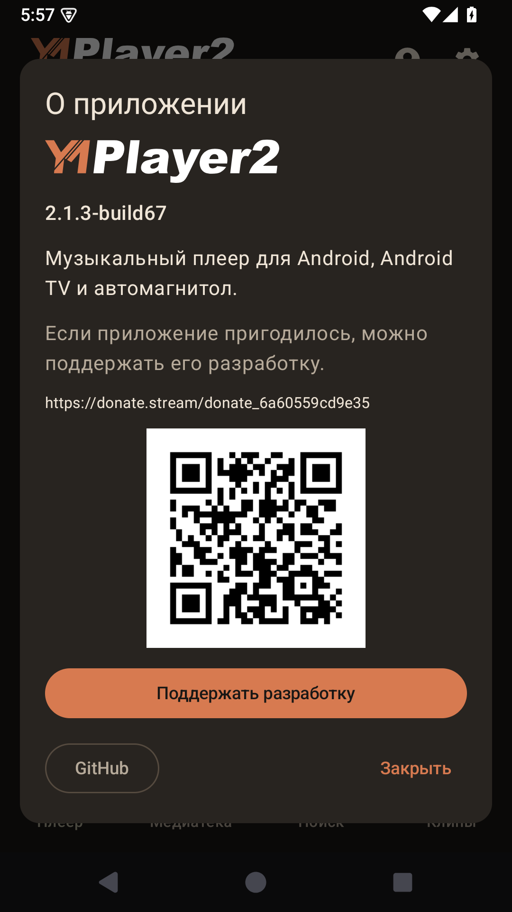

*2.1.3-build67, подписанный APK на проектном эмуляторе Android 15.*

## Настройки — быстрый справочник

| Пункт | Для чего нужен |
| --- | --- |
| **Язык приложения** (2.2) | Auto, English, Russian; общий сохраняемый выбор для устройства. |
| **Качество звука** | Отдельное качество онлайн-музыки и офлайн-загрузок. |
| **Оформление** | Тёмный, светлый или системный режим. |
| **Скины** | Предпросмотр, применение, импорт и удаление оформления. |
| **Настройки офлайн-кэша** | Включение/выключение кэша устройства, Wi-Fi, синхронизация и очистка. Список треков — в медиатеке. |
| **Диагностика** | Просмотр, обновление, очистка и экспорт журнала ошибок в Downloads. |
| **Боковая панель** | Жесты и набор кнопок панели K4811. |
| **Обновление приложения** | Проверка версии, загрузка и открытие установки APK. |
| **О приложении** | Версия, GitHub, поддержка разработки и QR-код доната. |

Номер установленной версии показан внизу настроек. Вход в Яндекс находится
на странице **Профили**, а не внутри общих настроек.

## Если что-то не работает

| Ситуация | Что проверить |
| --- | --- |
| Код принят в браузере, а вход ещё не завершён | Вернитесь на страницу аккаунта плеера и дождитесь подтверждения. При истёкшем коде получите новый; проверьте сеть и выбранный профиль. |
| Нет треков устройства | Подключите нужную папку через «Папки с музыкой», подтвердите доступ и обновите каталог. |
| USB-треки недоступны | Подключите носитель, проверьте доступ к папке. Сохранённый плейлист не гарантирует, что носитель сейчас подключён. |
| Не видны лайки, вместо них «?» | Состояние ещё не загружено. Повторите получение отметок и проверьте вход/сеть. |
| Офлайн-поиск пуст | Проверьте, включён ли офлайн-кэш, затем профиль и синхронизацию «Мне нравится». Наличие лайка само по себе ещё не означает, что файл скачан. |
| Смена качества не изменила скачанную музыку | Новая настройка применяется к новым загрузкам. Для полного обновления кэша удалите офлайн-файлы и синхронизируйте заново. |
| Скин не импортируется | Выбирайте .ymskin целиком. Проверьте пакет по руководству автора; действующий скин при ошибке сохранится. |
| Нет внешнего эквалайзера | Установите совместимый эквалайзер/DSP или используйте системный, затем выберите его через меню плеера. |
| GitHub не открывается | Скачайте APK из шапки 4PDA либо воспользуйтесь резервным источником в обновляторе. |

Для сообщения об ошибке откройте **Настройки → Диагностика → Экспорт в Downloads**.
Укажите версию приложения, устройство и Android, источник музыки и короткую
последовательность действий. Приложите журнал и, если проблема визуальная, снимок экрана
в [теме 4PDA](https://4pda.to/forum/index.php?showtopic=1127108) или
[GitHub Issues](https://github.com/reziarlleh/YMPlayer2/issues).
Пароль, токен и действующий код входа публиковать не нужно.

---

Руководство описывает выпущенный интерфейс, а не будущие функции.
Происхождение иллюстраций и сверка с исходниками — в
[заметке к документации](USER_GUIDE_VERIFICATION.md).
