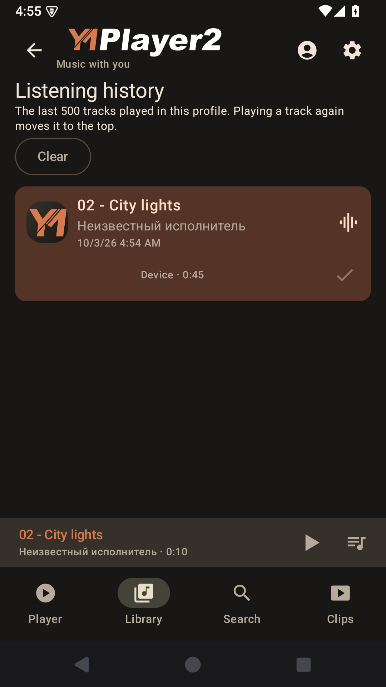
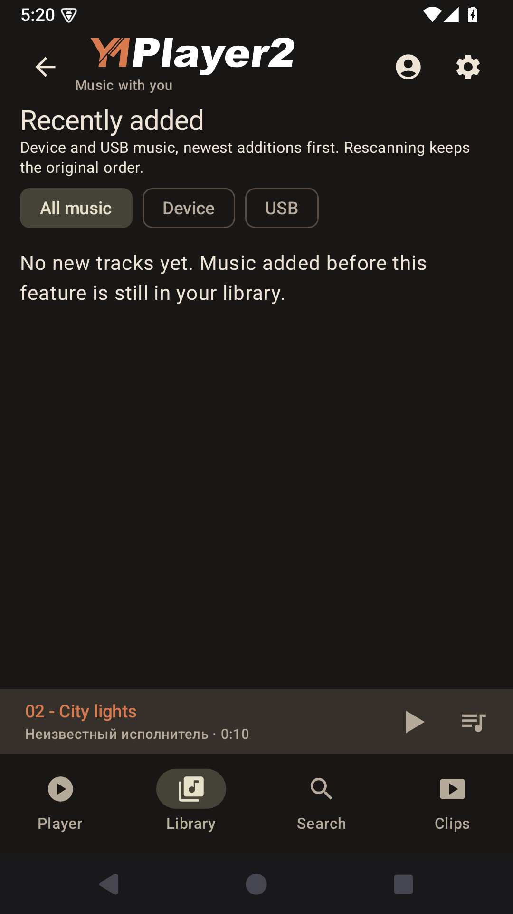
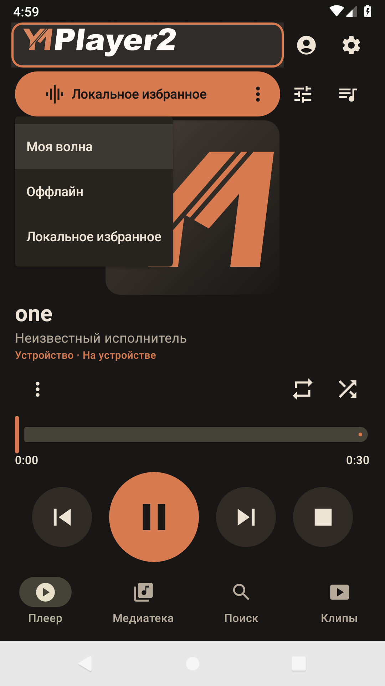
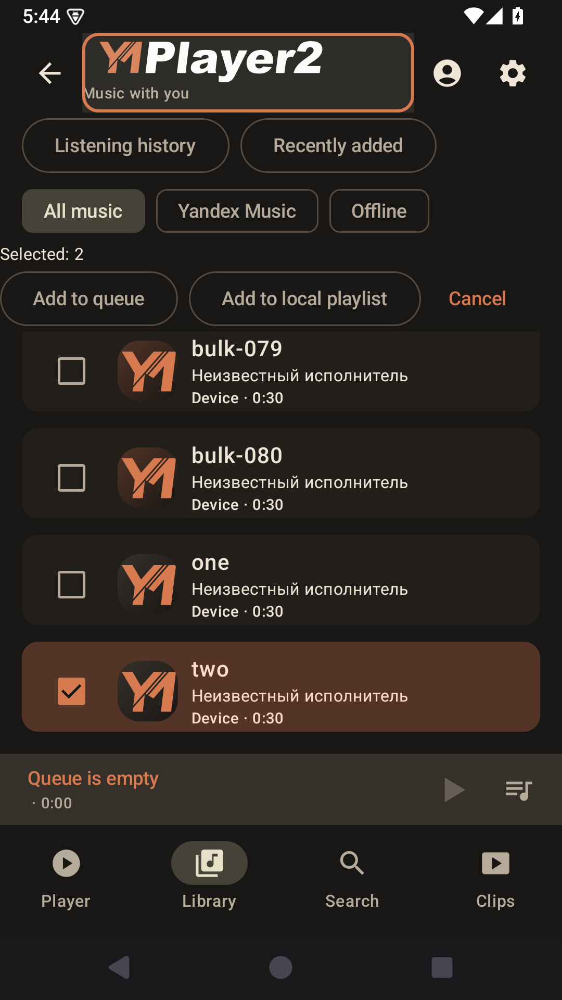
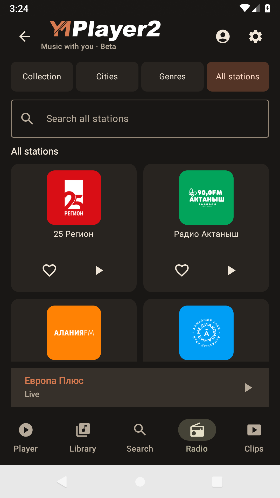

# YMPlayer 2 — user guide

For **2.5.3-build101**, Android9 and later. Reviewed on 9 October 2026.
My Vibe settings, radio sources and list modes are available in the stable release.
Installing an update over an earlier2.x release keeps your app data.

YMPlayer 2 plays music from your device and USB storage, Yandex Music and music
videos. It supports separate profiles, offline liked tracks and custom skins.
You do not need a Yandex account to play your own files.

[Download the latest APK](https://github.com/reziarlleh/YMPlayer2/releases/latest) ·
[Russian guide](USER_GUIDE.md) · [Project home](../README.md) ·
[4PDA discussion](https://4pda.to/forum/index.php?showtopic=1127108)

## Install and get started

Android 9 or later is required. The same APK works on phones, tablets, Android
TV and car head units; the layout adapts to the screen.

1. Download the latest APK and open it. Allow installation from that source if Android asks.
2. Open **YMPlayer 2**.
3. For your own music, go to **Library → All music → Music folders** and add a folder.
4. For Yandex Music, choose a profile and sign in with a device code.

2.x is an independent application. It does not need 1.x and has its own accounts,
settings, playlists, cache and update channel. Both applications can be installed
at the same time. To update 2.x, install the new APK over the existing application;
uninstalling it first would remove its private data.

## Find your way around

| Section | What it contains |
| --- | --- |
| **Player** | Current track, playback controls, queue, My Vibe and equalizer shortcut. |
| **Library** | Local/USB music, your Yandex collection, playlists and offline downloads. |
| **Search** | Search by track, artist or album; choose the source you want to search. |
| **Clips** | A personalized stream of Yandex music videos. |

The menu sits at the bottom in portrait mode and on the left on wide screens.
The profile icon and settings button are in the top bar. Select the wide logo
to open **About**. Other pages have a mini-player; select its title to return to
the full player.

**Back** goes up one level. On the main player, press Back twice within two
seconds to close the interface. Background playback can still be controlled
from the media notification and media buttons.

*Illustrations below include earlier stable releases with Russian labels. They
show the layout and controls; the current app supports English.*

## Buttons and states

| Icon | Action |
| :---: | --- |
|  /  | Start/resume playback or pause. |
|  /  | Previous or next track. |
|  | Stop playback. |
|  | Open the queue. |
|  | Add this track to the queue. |
|  | On a track card: already in the queue. It does not mean downloaded or liked. In selection/editing dialogs: selected or done. |
|  | Play the list indefinitely in random order. Highlighted when enabled. |
|  /  | Repeat the list or the current track. No highlight means repeat is off. |
| **Continue with radio** | Start radio after a Yandex list ends, using that list’s source. Available for lists with a known source; turns shuffle and repeat off. |
|  | Open your selected external equalizer or DSP. |
|  | Additional actions for this item and source. |

Select an artist’s name to open their Yandex page with popular tracks and albums.
The track’s **More** menu contains actions for its artists; a like beside the
track applies to the track itself.

On Android TV, Left/Right on the progress bar seeks within the track. Up/Down
moves to another control. Regular lists offer shuffle and repeat;
Yandex lists with a known source also offer radio continuation. Any active radio
stream chooses its own sequence and hides these controls.

## Local music, USB and search

On Android9–10, adding a folder offers **System folder picker** and **Folder on storage**.
Use the latter if a head unit does not show USB storage in its system picker.
Allow YMPlayer to read storage, open the desired folder, then select **Use this folder**.
Another file manager’s access does not grant access to YMPlayer. Files stay in place;
access depends on the firmware and permissions. Android11+ uses the system picker.

Open **Library → All music → Music folders**, select **Add from device** or
**Add from USB / SD**, then choose a folder in Android’s file picker and grant
access. The player reads those files in place. It does not copy or modify them.
Use **Refresh library** after adding or deleting files. Removing a folder from
the library disconnects it without deleting its files. Connected folders are
shared by all profiles.

Browse by tracks, albums, artists, genres, folders or playlists. Source filters
limit the list to device/USB music; availability filters hide inaccessible
items. A saved playlist cannot make an unplugged USB drive available.

The local engine supports MP3, AAC/M4A, FLAC, Ogg Vorbis/Opus/FLAC, Opus, ordinary
PCM WAV and AMR. A filename extension alone cannot guarantee playback: the
container, codec and device decoder also matter. AIFF is excluded; APE, WMA,
DSD and a dedicated ALAC decoder are not included in the supported set. There is
no bundled FFmpeg decoder package. See the [format details in the Russian guide](USER_GUIDE.md#форматы-локальной-музыки).

In **Search**, select **All music**, **Yandex Music** or **Offline**. Offline
search looks only in downloaded liked tracks for the current profile and stays
on the search page. The query remains when you switch sources. Yandex search
also supports artists, albums and playlists and requires sign-in.

## Listening history

Open **Library → Listening history**. Each profile keeps its last 500 distinct
tracks, with the most recently played first. Playing a track again moves it to
the top. Only actual audio playback creates a record; selecting, buffering,
prefetching or restoring a paused track does not.

The history stores track information, not audio files or signed stream addresses.
Select a track to play it again as a one-track list using its current source. An unavailable USB
track keeps its name, but you must reconnect its storage. Yandex playback still
requires the current profile’s account or usable offline download.

**Clear** asks for confirmation and clears only this profile’s history. It does
not remove files, offline downloads or playlists.

*Signed 2.3.0-build75 on the project’s Android 15 emulator, with a local test track.*

## Recently added

Open **Library → Recently added** to find new device and USB tracks.
Choose a source or load the next page. Rescanning and changing file tags keep
the original order. Disconnected USB tracks retain their labels but cannot
play until you reconnect the drive. Music added before this feature remains
in the regular library: its original date is unknown. Forgetting a folder
and adding it again counts as a new addition.

## Yandex sign-in and profiles

1. Open **Profiles**, choose the profile you want, then open its Yandex account page.
2. Request a sign-in code. Write it down before opening the browser: the next page may not allow pasting it.
3. Open the Yandex authorization page, enter the code and approve access.
4. Return to the player and wait for confirmation. If the code expires, request a new one.

You never enter your Yandex password in the player. 2.x stores its own sign-in;
it does not read the credentials of 1.x. Each profile has its own account, queue,
position, history and personal collection. Switching profiles does not mix accounts.
The guest profile can play local files without signing in.

## Your collection, recommendations and My Vibe

Choose **Yandex Music** in the library to browse liked tracks, favorite albums,
favorite artists and playlists. Recommendations show suggested playlists.
**My Vibe** starts your personalized stream. It prepares the next track while
the current one plays and requests further recommendations as needed.

The button at the top of the player shows the current
source or list name. Press it to select **My Vibe**, **Offline** or **Local favorites**.
Offline is available immediately, even with an empty cache and no internet.
It is disabled only when offline caching is switched off in Settings.
Empty local favorites cannot be selected. Choose
playlists in the library; the player button displays their names.

Screenshot with test music on an emulator; the source menu is shown in Russian.

A Yandex track, artist, album or playlist has **Start … radio** in its More menu.
The track menu places artist and album radio commands next to their own names.
The chosen source is kept for subsequent recommendations and restoration.
The app restores the previous playing or paused state as described below.

The radio icon next to repeat enables **Continue with radio when the list ends**.
It appears for a Yandex list with an identifiable source: an album, playlist,
artist's popular tracks or Liked tracks. Local lists, cached tracks and general
search results do not have a Yandex list radio source. Playback still uses the
already loaded pages when you select “Play shown tracks”.

Shuffle, repeat list/one track and radio continuation are mutually exclusive:
enabling one turns the others off. Shuffle plays indefinitely within the chosen
device/USB/Yandex list. Turning it off does not restore a previous mode. All
three controls are hidden during radio playback. Pause and Stop do not start
radio; Stop keeps the source. Manually editing the queue clears its association
with the original playlist.

Settings are available only while **My Vibe** is active, including when paused.
If another source is playing, first select My Vibe from the source button.
Offline playback, playlists and radio based on an item do not show this button.
Select **More (…)** on the right, inside the My Vibe
button, to customize activities, music selection, mood and language. Available
choices and regional language labels come from Yandex for the current account.
Any is the first choice in each group.
A separate Russian-only filter alongside a regional language has not yet been
verified through the API.

Choices are saved in YMPlayer2 for that account. **Close** keeps the current music
playing and uses the choices the next time you start My Vibe; **Start My Vibe**
starts a new session immediately. **Reset choices** returns to Any. These choices
do not change Yandex's web player settings. All controls work with a TV remote;
only the settings dialog scrolls when it needs more space.

Likes and dislikes apply to the item shown:

- A track like adds it to **Liked tracks**; an artist like adds the artist to favorites.
- An album can be added to favorite albums. Favoriting an album does not like every track on it.
- A track dislike means do not recommend that track; an artist dislike means do not recommend that artist.

The buttons show the current server state. If that state is unknown, refresh it
before interpreting an unfilled icon as an unliked item. Artist actions are
available through the track’s More menu or the artist page.

## Queue and playlists

Open **Queue** to inspect the current list, remove items or move them. The add
icon on a track becomes a check mark once it is already in the queue.
Regular lists support shuffle and repeat. My Vibe manages a short upcoming
sequence itself; ordinary queue modes do not apply to it.

Local playlists contain references to your device/USB tracks. Create a playlist,
rename it, add/remove tracks and enter editing mode to change their order.
Use the up/down controls to move tracks. Removing a playlist item does not
delete the underlying file.

Yandex playlists are separate server lists. You can create and edit your own
playlists, rename them and add/remove/reorder tracks. Drag the handle in the
Yandex playlist editor, or use the position command for an exact move with a remote.
Other users’ playlists
are available for listening; the app does not grant editing rights to them.

## Select several tracks

Choose **Select tracks** in a track list, then select cards or checkboxes.
On a remote, press OK. Selecting does not start playback, and loading another
page keeps your choices. **Add to queue** adds available tracks in the order
selected, skipping existing queue members. **Add to local playlist** adds device
and USB tracks to an existing playlist or creates a new one. Yandex tracks can
join the queue but cannot join local playlists.

The action bar stays visible while you scroll in selection mode. Cancel or Back
clears the selection. Changing section, profile, source, filter or search also
clears it. Your audio files stay untouched. If a local track disappears before
saving, the whole playlist change is rejected; adjust your selection and retry.

## Offline music

**Settings → Offline cache settings** contains the cache switch, Wi-Fi-only
option, synchronization, cancellation and deletion. **Library → Offline**
contains the downloaded tracks and **Play downloads**. Settings and track lists
are separate pages.

1. Enable the offline cache and check whether downloads should use Wi-Fi only.
2. Select **Sync liked tracks** and wait for completion.
3. Open **Library → Offline** and play the list or a track.

Only liked tracks and their covers are synchronized. Favorite artists, albums
and whole playlists are not downloaded automatically. Run synchronization again
after new likes. Downloads belong to both the profile and its Yandex account.

The list opens without auditing every audio file. Each selected download is
verified before playback. If it is damaged, synchronize again; Offline mode
does not replace it with an online stream.

You can disable the cache on an always-online TV with little storage. This stops
synchronization and prevents new playback requests from using cached music.
Existing downloads remain; use the delete command to reclaim space. Re-enabling
the cache makes retained downloads available again. The switch applies to the
device, while downloaded collections remain account/profile-specific. My Vibe’s
temporary next-track preparation is separate from this permanent cache.

## Audio quality and equalizer

**Settings → Audio quality** has independent choices for **Online playback**
and offline downloads: Auto, 128 kbps, 192 kbps, 320 kbps and Maximum. The API’s
available files determine the actual format/bitrate; the app does not transcode
each track to the selected number. Auto and Maximum choose the best available option.

A change affects newly requested streams/downloads. It does not rewrite the
current track, already prepared My Vibe audio or existing downloads. To replace
the whole offline cache at a different quality, change the setting, delete its
files and synchronize again.

The player’s equalizer/DSP button opens an external app or system panel. Use
the More menu to choose a different handler. YMPlayer 2 has no built-in
multiband equalizer.

## Internet connection

Radio, Clips and Yandex Music allow five seconds for the connection to become
available. If it does not, **No internet connection** and **Retry connection**
appear. Retry starts a fresh five-second check. When the connection returns,
the notice disappears and the catalogue reloads. Service errors are shown
separately when internet access is available.

Local files, USB and the offline cache stay available without internet access.
Switching to them clears the notice. A stopped player does not start just because
the network returns; an explicit retry can reconnect failed playback. Clips keep
their position and paused state. If the first connection arrives while the clip
screen is in the background, return to that screen to start the video.

## Music videos

**Clips** requires Yandex sign-in and a network connection. Audio and video do
not play at the same time. Tap the video to show or hide controls. During playback
the controls hide after five seconds; they remain visible when paused or on error.

**← Back** and the system Back button close the video and return to the section
you opened it from. The clip stays paused; music/radio does not resume automatically.
The return section also survives process termination. Older sessions
without that record return to Player.

Selecting **Clips** again starts playback from the saved position. Restoring
the app preserves its previous play/pause state. While a requested start is
buffering, the button shows Pause; you do not need a second Play press.

The center button plays/pauses; the side buttons select the previous/next clip.
The **NOW** panel shows the current title and artist, **NEXT** shows the next
clip. Its name may be pending while the next item is being found. The current
panel’s background darkens from left to right as playback progresses; the next
panel is unaffected. Rotation keeps the clip and playback position.

On a remote, the first arrow/OK press reveals hidden controls and focuses
play/pause. The next press operates the controls. Media Play/Pause/Next/Previous
buttons also work.

*This illustration uses a local test video and sample metadata on TV29.*

## Language and skins

Choose **Settings → App language**. Auto follows the system and is the default.
The list includes Belarusian, English, French, German, Kazakh, Russian, Spanish
and Ukrainian, ordered by their English names. Each entry also shows its native
name. Changing language keeps playback running and leaves your music, playlist
and skin names unchanged.

**Appearance** chooses Dark, Light or System. The choice is saved immediately
and survives app termination. System follows Android’s current light or dark theme. **Skins** chooses the palette and
supported icon artwork. Built-in Oxide (Оксид), Harbor (Гавань), Olive (Олива)
and Silver (Серебро) skins have both
dark and light palettes. Preview a skin, check both modes, then apply it or cancel.
Changing modes inside a preview only changes the preview.

For a custom skin, download a **.ymskin** package and import the whole file; do
not unpack it. Review the preview before applying. An invalid package does not
replace the active skin. Switch away from an imported skin before deleting it.
Deletion leaves the original downloaded package intact. Skins do not move buttons
or change their actions, the launcher/TV logo or the K4811 sidebar’s styling.
See [skin packages](../skins/README.md) and the [author guide](SKIN_AUTHOR_GUIDE.md).

## K4811 sidebar

This panel is intended for **K4811** head units. Open **Settings → Sidebar**,
grant Android’s display-over-other-apps permission and enable it. A short swipe
from the configured edge opens the panel; its small gesture area is invisible.

Choose which controls to include: volume up/down, mute, play/pause, home, menu,
back, sleep and reboot. Hide is always last. Disabling all optional controls
disables the panel. Reboot asks for confirmation. The menu opens the K4811 app
list, and play/pause controls the active player. Auto-hide can fold the panel
after eight seconds. This vendor integration is not a general promise for all
Android devices.

## Updates, diagnostics and donations

**Settings → App update** can check on launch, at most once daily. Use the
manual check whenever you need it. Download an offered release and approve
Android’s installation prompt. If GitHub is unavailable, choose the backup
download when offered. The APK is checked before the installer opens.
Automatic checking does not mean silent installation.

**Settings → Diagnostics** lets you inspect, refresh, clear and export the
error journal to Downloads. After a crash, reopen the app and export the log
before clearing it. From2.3.3, it includes the last Java exception type and
stack without exception messages, device/display settings and the selected
keyboard. Android11+ also provides system process-exit reasons; Android10
does not support that part. Search text, track titles and tokens are not
recorded. Reports stay on your device until you choose to share them.

Use the dedicated
Radio section instead. The journal records connection/playback/error events
without stream URLs, station or track names, or tokens.

On Android 9, export opens the system file picker instead: choose
a destination and save the report. A toast confirms the result. Cancelling
the picker does not save a file.

**Clear** removes the saved crash and events and hides older system exit records
from later exports. A useful bug report includes the app version,
device/Android version, music source, steps, journal and a screenshot if relevant.
Use [GitHub Issues](https://github.com/reziarlleh/YMPlayer2/issues) or the
[4PDA topic](https://4pda.to/forum/index.php?showtopic=1127108). Keep passwords,
tokens and live sign-in codes out of public reports.

**About** is available from Settings and from the wide header logo. It shows
the version, GitHub link, donation button and QR code. Scan the QR code with
your phone when using a TV; it leads to the same donation page as the button.

## Quick troubleshooting

| Problem | Check |
| --- | --- |
| Code accepted in the browser, sign-in still pending | Return to the account page; check network/profile and request a new code if it expired. |
| No device tracks | Add the folder through Music folders, grant access and refresh the library. |
| USB entries unavailable | Reconnect storage and check folder access. Playlist/history metadata is not a substitute for the source file. |
| Offline search is empty | Check the cache switch, profile and synchronization. A like alone does not mean downloaded. |
| Downloads sound unchanged after changing quality | The setting affects new downloads. Delete the cache and synchronize again to replace it. |
| Custom skin will not import | Select the complete .ymskin file and check its package format. The active skin remains in place on error. |
| No equalizer available | Install a compatible equalizer/DSP or select an available system handler. |
| GitHub cannot be reached | Use the backup update source or the APK attached to the 4PDA topic. |

## Radio

**Radio** sits between **Search** and **Clips**. The public catalogue and streams
work without sign-in. Your station collection uses the Yandex account already
saved in the current profile; there is no separate Radio sign-in.

- **Collection** shows favourite stations followed by the general catalogue.
  The player's heart adds or removes the station, rather than liking the song
  currently on air. Each profile has its own collection on Yandex.
- **Cities** opens a searchable city picker. A city selects local station streams;
  **All cities** clears this filter.
- **Genres** filters the catalogue; **All genres** clears the filter.
- **All stations** shows the general catalogue and loads more as you scroll.
  Cities, genres and search results use a vertically scrolling station grid.
  After a network error, **Retry** continues without losing the stations already loaded.
- **Search all stations** always searches the full catalogue, regardless of the
  city or genre filter. Clear the search field to return to your filter.

Each station has separate heart and Play buttons: the heart adds or removes
it from your collection, and Play starts the stream. Select its image/name to
open a larger card with the description supplied by Yandex. **Back** returns to
the same list, scroll position and remote-control focus. Opening the card does
not change the stream currently playing. The player shows the station,
city, and **On air now** title/artist when supplied by the station. **Stop** closes
playback; **Play** reconnects to the current live broadcast. Radio has no seeking,
repeat or shuffle. It retries temporary network failures; stopping, switching
profiles or starting music/clips cancels those retries. The last station is saved
per profile. Opening the app resumes a station that was playing;
a stopped station stays stopped. Live radio returns to the current broadcast,
not a saved timestamp.

Collection keeps two horizontal carousels: favourites and all stations. Both
load more as you scroll, without a separate More stations button; Retry remains
available after a loading error. Its
player stays below them in portrait and to their left in landscape. Other pages
use the main area for the grid, with the selected stream in the mini-player.
Touch and remote controls are supported. Background playback uses the same
notification and media controls as music; the mini-player returns to Radio.
Starting music or a clip stops the station. Broadcasts are not downloaded to
Liked Songs offline. Show subscriptions and liked radio tracks are not included.

For CWG, select YMPlayer2 as the external player and allow CWG notification access.
In the tested CWG3.6.3-R2, long-press Play to choose a player. CWG shows the station
logo and current song/artist. Its Pause closes the stream; Play reconnects to the
live broadcast. The logo may appear after the text while the image downloads.

[The stable release](https://github.com/reziarlleh/YMPlayer2/releases/latest) updates the existing app and keeps its data.

Signed beta93 on Android9: the station grid with the English interface.

[Example of a full station card](qa/radio-catalog-2026-10-07/emulator-5560-signed93-detail.png).

## Returning to your session

In **2.5.0**, the app remembers the selected section and
last player. Music and clips return to their saved position: playing content
resumes, while paused content stays paused. Radio restores the same station
and its playing/stopped state, using the current live broadcast. Only the last
source resumes, without another player starting alongside it. Radio also saves
its selected tab, search query and filter separately for each profile.

Position is saved once a second and when leaving the screen. An abrupt process
termination can lose a short final interval; a power loss before the OS writes
the data to storage cannot be recovered reliably. Backgrounding a clip pauses
its video while retaining its previous play intent. Returning restores that
intent; an explicit Pause or Close saves a paused session.

Booting the device or querying media metadata does not start playback. Resume
happens when you open the app. If you left the clip player and selected another
section, that section opens; the clip position remains available when you open
Clips again. An unavailable USB/file, missing login or network failure can prevent
playback; select an available source or retry. Earlier builds did not save the
new play/pause flags, but their queues, profiles and selected stations are retained.

Missing local artist, album and genre tags use labels in the selected UI language.
Real names remain unchanged. Older ambiguous labels are re-read from the original
media on the next library refresh when the folder or USB drive is available; archived names are kept verbatim.

---

This guide describes released features. Earlier screenshot versions and their
test origins are documented in [the documentation verification note](USER_GUIDE_VERIFICATION.md).
